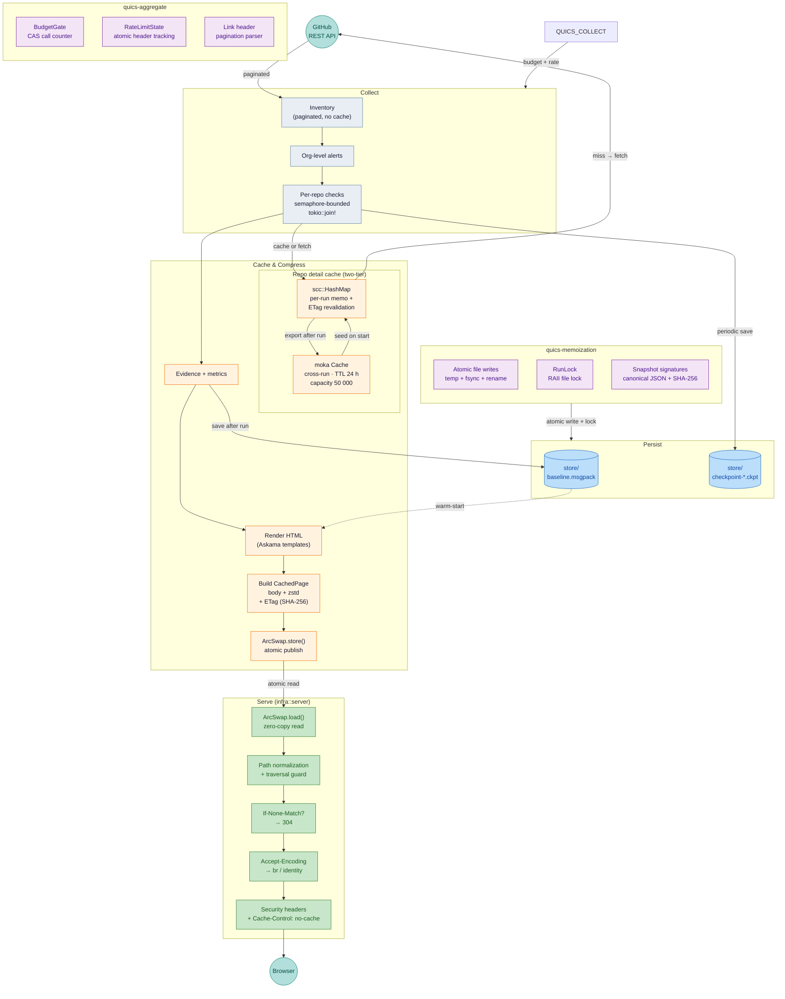

# Operations Guide

Deployment, authentication, permissions, logging, output layout, retention, and architecture for `gh-report`.

## How It Works

`gh-report` is a single long-running process:

1. Performs an initial data collection against the configured GitHub organization.
2. Starts an HTTP server (in-memory cache — no disk I/O on the serving path).
3. Re-collects every 3 hours.
4. Shuts down gracefully on `Ctrl-C` or `SIGTERM`.

A file lock (`store/collector.lock`) prevents overlapping collections. If a scheduled run starts while a previous one is still in progress, the new run is skipped with a warning.

## Supported Platforms

`gh-report` targets **GitHub.com** only — both GitHub Cloud (GHEC, including Enterprise Managed Users) and free/pro/team organizations. GitHub Enterprise Server (GHES) is **not supported**. Authentication metadata parsing, API URL construction, and `gh auth status` host resolution all assume `github.com` as the host.

## Authentication

Three authentication modes, in precedence order. If more than one production credential source is configured simultaneously, startup fails with a configuration error.

### 1. GitHub App (recommended for production)

| Variable | Required | Description |
|----------|----------|-------------|
| `GH_APP_ID` | Yes | Numeric GitHub App ID |
| `GH_APP_PRIVATE_KEY` | Yes* | PEM-encoded RSA private key (inline) |
| `GH_APP_PRIVATE_KEY_PATH` | Yes* | Path to PEM key file (alternative to inline) |
| `GH_APP_INSTALLATION_ID` | No | Explicit installation ID; derived from org if omitted |

\* Provide exactly one of `GH_APP_PRIVATE_KEY` or `GH_APP_PRIVATE_KEY_PATH`.

**Private key file permissions:** On Unix, the key file must have mode `0600` (owner-only). The application rejects world- or group-readable key files.

**Token lifecycle:** Installation tokens are automatically refreshed before expiry. The initial JWT is valid for 10 minutes (GitHub's maximum).

### 2. Personal Access Token (PAT)

Set `GITHUB_TOKEN` in the environment. Both classic and fine-grained tokens are supported.

### 3. `gh` CLI fallback (local development only)

If neither GitHub App nor `GITHUB_TOKEN` is configured, `gh-report` falls back to `gh auth token`. This mode is a **local developer convenience only** and should never be used in production.

## Required Permissions / Scopes

### Classic PAT

| Capability | Minimum scope |
|------------|---------------|
| Repository inventory (including private repos) | `repo` (add `read:org` if org membership APIs are needed) |
| SECURITY.md / CODEOWNERS file checks | `repo` |
| Branch protection and rulesets | `repo` (admin-visible endpoints may require additional access) |
| Secret scanning alerts (org + repo) | `repo` + endpoint-specific security access |

**Full tier** (all checks available): `repo`, `read:org`, `security_events`

### Fine-grained PAT / GitHub App

| Capability | Permission |
|------------|------------|
| Repository inventory and metadata | Repository metadata: **read** |
| SECURITY.md / CODEOWNERS content checks | Repository contents: **read** |
| Branch protection / rulesets / security settings | Repository administration: **read** |
| Secret scanning alerts (repository **and** organization) | Secret scanning alerts: **read** |

> **Secret scanning alerts is a Repository permission.** GitHub classifies "Secret scanning alerts" as a *repository* permission even though it also gates the org-scoped endpoint `GET /orgs/{org}/secret-scanning/alerts`. Selecting it once (under **Repository permissions** → **All repositories**) grants both the per-repository and organization-level alert reads. There is no separate organization-level toggle for this; do **not** confuse it with "Secret scanning alert dismissal requests", which is a distinct organization permission gating the delegated-dismissal workflow and is **not** used by `gh-report`.

> **Repository access** must be set to **All repositories** for the token to see all org repos. Fine-grained PATs do not expose the `X-OAuth-Scopes` header — the token tier will display as `Unknown` in the report metadata. This is expected.

### Fine-grained PAT quick start

1. Go to GitHub → **Settings** → **Developer settings** → **Fine-grained personal access tokens**
2. Set **Resource owner** to your target organization
3. Set **Repository access** to **All repositories**
4. Grant the permissions listed above
5. Run:

```sh
export GITHUB_TOKEN="github_pat_..."
gh-report --org MyOrg
```

### Capability probes

At startup, `gh-report` probes which API families are accessible. Mandatory capabilities (repository inventory) must succeed or the run fails. Optional capabilities (secret scanning, branch protection, etc.) degrade to `unknown` status with explicit observability notes when unavailable.

## Logging

### Format

```sh
# Human-readable (default)
gh-report --org MyOrg

# Structured JSON (for log aggregation)
gh-report --log-format json --org MyOrg

# Via environment variable
GH_REPORT_LOG_FORMAT=json gh-report --org MyOrg
```

### GCP Cloud Logging (Cloud Run)

When deployed on Cloud Run, set `GH_REPORT_LOG_FORMAT=json` in the container environment. The JSON output is formatted for automatic parsing by Cloud Logging:

- **`severity`** mapped from tracing levels (`ERROR`, `WARNING`, `INFO`, `DEBUG`). Enables severity filtering in Logs Explorer.
- **`message`** at the top level — displayed as the main log line in Logs Explorer.
- **`time`** as RFC 3339 timestamp with microsecond precision.
- **`target`** identifies the Rust module path (e.g., `gh_report::app::collect`).
- All structured fields (e.g., `repos=560`, `run_id=...`) appear as top-level JSON keys, queryable via `jsonPayload.<field>` in log queries.

Severity mapping:

| tracing level | Cloud Logging severity |
|---------------|------------------------|
| `ERROR`       | `ERROR`                |
| `WARN`        | `WARNING`              |
| `INFO`        | `INFO`                 |
| `DEBUG`       | `DEBUG`                |
| `TRACE`       | `DEBUG`                |

### Verbosity

Control via the `RUST_LOG` environment variable:

```sh
RUST_LOG=debug gh-report --org MyOrg            # all modules debug
RUST_LOG=gh_report=debug gh-report --org MyOrg   # only gh-report debug
RUST_LOG=warn gh-report --org MyOrg              # warnings and errors only
```

Default level is `info`.

### Redaction discipline

- Tokens are stored as `SecretString` (via the `secrecy` crate) and never logged
- The `GitHubCredential` and `InstallationTokenResponse` types use manual `Debug` implementations that emit `[REDACTED]` for token fields
- `expose_secret()` is only called at the I/O boundary (HTTP Authorization header, JWT signing)
- API error response bodies are truncated to 1024 bytes to prevent token echo attacks
- Untrusted pagination URLs are sanitized before logging
- No `println!` / `eprintln!` usage — all output goes through `tracing`

## Output Layout

```
store/
├── baseline.msgpack           ← baseline cache for cross-run reuse
├── collector.lock             ← file lock preventing overlapping collections
└── checkpoint-YYYY-MM-DD.ckpt ← binary MessagePack checkpoint (removed after success)
```

There are no per-run directories, staging areas, symlinks, or `evidence.json` files on disk. Rendered pages exist only in memory.

**In-memory pages** (served via `ArcSwap<HashMap<String, CachedPage>>`):

| Path | Description |
|------|-------------|
| `index.html` | Dashboard landing page (`http://localhost:8080/`) |
| `report.html` | Detailed security posture report |
| `owners.html` | Owner summary (when CODEOWNERS data is available) |
| `owners/{slug}.html` | Per-owner detail pages |
| `orphans.html` | Repositories without CODEOWNERS |
| `style.css` | Shared stylesheet (compiled into binary, served from cache) |
| `ws.js` | WebSocket auto-reconnect client for live page updates |

**Security invariant:** The web server serves only from the in-memory cache. Only `.html`, `.css`, and `.js` content is stored. Baseline and checkpoint files are never exposed via HTTP.

## Architecture Dataflow



**Key design points:**

- **No persistent inventory cache.** Repository inventory is fetched fresh from the GitHub API on every run via paginated REST calls.
- **Two-tier repo detail cache.** Per-run `scc::HashMap` provides concurrent memoization with ETag conditional revalidation. Cross-run `moka::future::Cache` (TTL 24 h, capacity 50 000) persists entries across daemon collection runs, seeded at start and exported at end.
- **Pre-compressed serving.** HTML, CSS, and JS pages are compressed with zstd (level 19) at cache-population time. `CachedPage` stores the raw body alongside the compressed variant. The server selects zstd → identity based on `Accept-Encoding`, with zero runtime re-compression.
- **Atomic publish.** A single `ArcSwap::store()` call replaces all pages instantly — no filesystem staging, no directory swaps, no reader-visible intermediate state. The serving path performs zero disk I/O.
- **ETag / 304.** Each `CachedPage` carries a weak `ETag` (SHA-256 truncated to 16 bytes). `If-None-Match` requests receive a 304 with no body transfer.
- **Warm-start.** If `store/baseline.msgpack` exists from a prior run, the daemon renders and publishes a cache from it before the first API collection completes, giving sub-second startup for page requests.
- **Partial publish on budget pause.** When the API call budget is exhausted mid-run, a background task builds interim evidence with pending-repo markers and publishes a partial cache.
- **Checkpoint format** is binary MessagePack with a `CKPT` magic header.

## Scoring Contract

Each repository receives a posture score derived from five security controls of equal weight. This section is the authoritative description of how that number is computed and classified; the dashboard, the report HTML, and downstream consumers all rely on it.

### Controls

| # | Control | Source field |
|---|---------|--------------|
| 1 | Security policy (`SECURITY.md` present and conforming) | `checks.security_policy.status` |
| 2 | Secret scanning enabled | `checks.secret_scanning.status` |
| 3 | Dependabot security updates enabled | `checks.dependabot_security_updates.status` |
| 4 | Branch protection on default branch | `checks.branch_protection.status` |
| 5 | CODEOWNERS present and conforming | `checks.codeowners.status` |

All five controls carry equal weight. There is no aggregation hierarchy and no weighted policy.

### Per-status classification

Each control's status maps to one of three score categories:

| Category | Meaning | Counted in numerator | Counted in denominator |
|----------|---------|----------------------|------------------------|
| `Pass` | Control is satisfied. | Yes (1) | Yes |
| `Fail` | Control is not satisfied. | No | Yes |
| `Excluded` | Status is indeterminate (`Unknown`, `PermissionDenied`) or not applicable (`NotApplicable`). | No | No |

Concretely: `Pass`, `Enabled`, `Conforming` map to `Pass`; `Fail`, `Disabled`, `Paused`, `Partial`, `NonConforming`, `Absent` map to `Fail`; `Unknown`, `PermissionDenied`, and `NotApplicable` map to `Excluded`. The complete enum-by-enum mapping is enforced by `From<…Status> for ScoreCategory` impls in `crates/gh-report/src/domain/checks.rs` and exercised by the `score_category_from_*` unit tests.

### Aggregation

Per repository:

```text
score = 100 × pass_count / total_count           where total_count = pass_count + fail_count
```

When `total_count == 0` (every control is `Excluded`, e.g. a brand-new private repository where capability probes returned `PermissionDenied` for everything), the repository is reported with score `N/A` rather than `0` or `100`. **`Excluded` is structurally distinct from `Fail`:** it does not penalise the score, it removes the control from the denominator. This prevents permission gaps and inapplicable statuses from being indistinguishable from genuine misconfiguration.

The result is rounded to one decimal place for display.

### Tiers

The numeric score is classified into a tier for colour-coding and tier-level metrics:

| Tier | Default range | Default threshold | Override |
|------|---------------|-------------------|----------|
| Pass (green) | `score ≥ 80.0` | `pass_threshold` | `--pass-threshold <pct>` |
| Warn (yellow) | `50.0 ≤ score < 80.0` | `warn_threshold` | `--warn-threshold <pct>` |
| Fail (red) | `score < 50.0` | — | — |
| N/A | `total_count == 0` | — | — |

Configuration constraints (validated at startup): both thresholds are in `[0.0, 100.0]` and `pass_threshold ≥ warn_threshold`. When `pass_threshold == warn_threshold`, the warn band collapses and scores are strictly pass or fail — this is a supported configuration.

### Stability

The set of controls and the per-status mapping are part of the schema contract: any change is a `EVIDENCE_SCHEMA_VERSION` bump (see [Schema Versions](#schema-versions)). The threshold defaults are not part of the schema contract — they are runtime configuration and may be overridden per deployment without invalidating baselines.


| Artifact | Retention | Notes |
|----------|-----------|-------|
| In-memory pages | Current run only | Atomically replaced on each collection via `ArcSwap` |
| `store/baseline.msgpack` | Persistent | Overwritten after each successful run; size limit 200 MB |
| `store/checkpoint-*` | Transient | Removed after successful publication |

No disk-based retention policies, pruning, or run directories exist. The baseline file is the only persistent artifact written by `gh-report` during normal operation.

## Baseline

The baseline mechanism reduces API calls across runs by reusing evidence for repositories that have not changed.

**Location:** `store/baseline.msgpack`

**How it works:** After each successful collection run, a baseline file is saved containing per-repository evidence keyed by inventory key. On subsequent runs, if a repository's `updated_at` timestamp matches the baseline entry, the previous evidence is reused without re-evaluating the repository via the GitHub API.

**Staleness note:** The `updated_at` timestamp reflects pushes and some settings changes, but not all security-relevant changes. For example, branch protection rule modifications may not alter `updated_at`, which could lead to stale baseline reuse for that check. The staleness window between inventory fetch and evaluation is documented in the `inventory_fetched_at` field of the report metadata.

**How to reset:** Delete `store/baseline.msgpack` to force a full re-evaluation on the next run, or bump the schema version (which invalidates the baseline automatically on load).

**Schema version bumps:** When `EVIDENCE_SCHEMA_VERSION` changes between releases, the baseline and any in-flight checkpoint are automatically discarded on the next run. This triggers a full cold-start re-collection. For large organizations this may take hours and consumes more API quota than a normal incremental run. The warm-start cache will be empty until the first full collection completes.

**Size limit:** 200 MB. Baseline files exceeding this limit are discarded with a warning.

## Schema Versions

`gh-report` stamps two schema version strings on its output. They are independent: each governs a distinct payload, and only `EVIDENCE_SCHEMA_VERSION` participates in baseline/checkpoint invalidation.

### Current versions

| Constant | Current value | Stamped on | Validated against on load? |
|----------|---------------|-----------|----------------------------|
| `INVENTORY_SCHEMA_VERSION` | `1.0` | `InventoryPayload` (per-run inventory snapshot) | No — informational metadata for downstream consumers; never read back by the daemon. |
| `EVIDENCE_SCHEMA_VERSION` | `15.0` | `Evidence`, `RepositoryEvidence`, `Checkpoint` | Yes — baseline and in-flight checkpoint are discarded on mismatch. |

Both constants live in `crates/gh-report/src/config/mod.rs`.

### When to bump

**`INVENTORY_SCHEMA_VERSION`** — bump on any breaking change to `InventoryPayload` shape that downstream consumers (other tooling, exports, archived snapshots) would not tolerate. The daemon itself never invalidates anything based on this value; bumping it is purely a contract signal to external readers.

**`EVIDENCE_SCHEMA_VERSION`** — bump on any of:

- Adding, removing, or renaming a field on `Evidence`, `RepositoryEvidence`, or any nested check struct.
- Changing the meaning or value domain of an existing enum (e.g. CODEOWNERS conformance semantics).
- Changing how a check is computed in a way that makes prior baseline values incomparable to new ones.

Each bump triggers full baseline + checkpoint discard on next run (see [Baseline](#baseline)). For large organisations this is a non-trivial cost — hours of API quota — so bumps are deliberate, batched, and documented in the relevant ADR / changelog entry.

### Version history

Version history is maintained forward-only from this point. Prior versions exist in the git log of `config/mod.rs` but are not enumerated here — recovering pre-`14.0` provenance from squashed commits is not reliable enough to be authoritative.

| Version | Date introduced | Notes |
|---------|-----------------|-------|
| `EVIDENCE_SCHEMA_VERSION = 14.0` | (initial) | Baseline at the time this section was written. |
| `EVIDENCE_SCHEMA_VERSION = 15.0` | 2026-05-05 | Added `CodeownersResult.truncation: Option<CodeownersTruncationReason>` and `CodeownersCounts.truncated: u32`. Surfaces previously-silent CODEOWNERS parse skips (encoding mismatch, oversized base64, decode/UTF-8 failure) so operators can detect data loss without scanning per-repo evidence. |
| `INVENTORY_SCHEMA_VERSION = 1.0` | (current) | Initial published version. |

When bumping, append a row with the new version, the date, and a one-line note describing what shape change drove the bump. The version of `EVIDENCE_SCHEMA_VERSION` is also surfaced in the report metadata so a baseline file's version is observable via `gh-report --dump-baseline`.

### Event log

The durable event log under `<events_dir>` (typically `store/events/`) is stored as MessagePack file-per-aggregate (`cherry_pit_gateway::MsgpackFileStore`, one `<aggregate-id>.msgpack` file per aggregate, atomic rewrite-on-append). CHE-0043:R1 flock semantics (advisory lock on `<events_dir>/.lock`) gate concurrent access.

### systemd (recommended)

```ini
# /etc/systemd/system/gh-report.service
[Unit]
Description=GitHub organization governance collector and reporter
After=network-online.target
Wants=network-online.target

[Service]
Type=exec
ExecStart=/usr/local/bin/gh-report --org MyOrg
EnvironmentFile=/etc/gh-report/env
WorkingDirectory=/opt/gh-report
Restart=on-failure
RestartSec=30

[Install]
WantedBy=multi-user.target
```

> **Security note:** Create the environment file with restricted permissions
> (`chmod 600 /etc/gh-report/env`, owned by the service user). It should
> contain `GITHUB_TOKEN=ghp_…` (one variable per line), or the relevant
> `GH_APP_*` variables when using GitHub App authentication. Never use
> `Environment=GITHUB_TOKEN=…` directly in the unit file — the value is
> visible to any user via `systemctl show`.

### Kubernetes Deployment

```yaml
apiVersion: apps/v1
kind: Deployment
metadata:
  name: gh-report
spec:
  replicas: 1
  selector:
    matchLabels:
      app: gh-report
  template:
    metadata:
      labels:
        app: gh-report
    spec:
      containers:
      - name: gh-report
        image: gh-report:latest
        args: ["--org", "MyOrg"]
        ports:
        - containerPort: 8080
        env:
        - name: BIND_ADDRESS
          value: "0.0.0.0"
        - name: GITHUB_TOKEN
          valueFrom:
            secretKeyRef:
              name: gh-report-token
              key: token
        livenessProbe:
          httpGet:
            path: /healthz
            port: 8080
        readinessProbe:
          httpGet:
            path: /readyz
            port: 8080
```

### Kubernetes / Knative Probe Configuration

`/healthz` returns 200 immediately (liveness). `/readyz` returns 200 only after the first successful collection completes.

For **first-ever deployments** (no `baseline.msgpack`), the initial collection may take minutes to hours depending on organization size. During this time `/readyz` returns 503, which can cause Kubernetes to kill the pod before it becomes ready. Use a `startupProbe` to give the pod time to complete its first collection:

```yaml
startupProbe:
  httpGet:
    path: /healthz
    port: 8080
  periodSeconds: 5
  failureThreshold: 60    # 5 × 60 = 300 s (5 min) grace period
livenessProbe:
  httpGet:
    path: /healthz
    port: 8080
  periodSeconds: 10
readinessProbe:
  httpGet:
    path: /readyz
    port: 8080
  periodSeconds: 5
```

**Warm-start** deployments (existing `baseline.msgpack`) render and publish a cache from the baseline within seconds, so `/readyz` passes quickly without needing a long startup grace period.

### Container / Cloud Run

The server binds to the address specified by `BIND_ADDRESS` (default `127.0.0.1`) and reads the port from the `PORT` environment variable (default `8080`). Container and Cloud Run deployments must set `BIND_ADDRESS=0.0.0.0` to accept traffic on all interfaces. Set `GH_REPORT_LOG_FORMAT=json` for Cloud Logging-compatible structured JSON output (see [Logging](#logging)).

#### Container Image

Multi-stage Dockerfile: Rust builder on Debian bookworm, runtime on `gcr.io/distroless/cc-debian12:nonroot`. No shell, no package manager in the runtime image. The binary runs as uid 65534 (nonroot).

| Property | Value |
|----------|-------|
| Runtime base | `gcr.io/distroless/cc-debian12:nonroot` |
| User | `nonroot` (uid 65534) |
| Exposed port | 8080 |
| Working directory | `/home/nonroot` |
| Log format | JSON (set via `GH_REPORT_LOG_FORMAT=json`) |
| Signal handling | SIGINT + SIGTERM → graceful shutdown |

#### Container Build (Podman)

Create a Podman machine with sufficient resources for Rust compilation (LTO + single codegen unit requires significant memory):

```sh
podman machine init --memory 16384 --cpus 4 --disk-size 60 gh-report-builder
podman machine start gh-report-builder
```

Build the image natively (must match host architecture):

```sh
podman build -f crates/gh-report/Dockerfile -t gh-report .
```

Cache mounts (`--mount=type=cache`) accelerate repeat builds by preserving the Cargo registry and target directory across invocations.

> **Architecture note:** On Apple Silicon (ARM64), this produces a `linux/arm64` image. Deploy to Cloud Run with `--execution-environment gen2` and ARM-based T2A instances for native performance. Cross-compiling to `linux/amd64` via QEMU is **not supported** — Rust's jemalloc allocator crashes under QEMU user-space emulation (`SIGSEGV` in `rustc -vV`). For `linux/amd64` images, use Cloud Build or a native x86_64 CI runner.

#### Verify

```sh
# Start with a test org (requires GITHUB_TOKEN or GH_APP_* env vars)
podman run --rm -p 8080:8080 -e GITHUB_TOKEN=ghp_... -e BIND_ADDRESS=0.0.0.0 gh-report --org MyOrg

# Health check
curl http://localhost:8080/healthz

# Non-root verification
podman inspect gh-report --format '{{.Config.User}}'

# Image size (expect ~30–50 MB)
podman images gh-report --format '{{.Size}}'
```

#### Push to Artifact Registry

```sh
podman tag gh-report REGION-docker.pkg.dev/PROJECT/REPO/gh-report:TAG
podman push REGION-docker.pkg.dev/PROJECT/REPO/gh-report:TAG
```

#### Cloud Run Deployment

The container requires `--org` at runtime. Supply it via Cloud Run args:

```sh
gcloud run deploy gh-report \
  --image REGION-docker.pkg.dev/PROJECT/REPO/gh-report:TAG \
  --platform managed \
  --region REGION \
  --port 8080 \
  --args="--org,MyOrg" \
  --set-env-vars="GH_APP_ID=12345,BIND_ADDRESS=0.0.0.0" \
  --set-secrets="GH_APP_PRIVATE_KEY=gh-report-key:latest" \
  --min-instances=1 \
  --max-instances=1 \
  --memory=512Mi \
  --cpu=1 \
  --no-allow-unauthenticated
```

> **ARM64 images:** Add `--execution-environment gen2` and `--cpu-boost` to the deploy command. Cloud Run gen2 supports ARM-based T2A instances. Without gen2, the deployment may fail or fall back to x86 emulation.

**Deployment notes:**

- `--min-instances=1` — the daemon must stay running for scheduled re-collection (3-hour interval).
- `--max-instances=1` — prevents concurrent instances with conflicting file locks.
- **Secrets:** For GitHub App auth, mount the private key via Cloud Run secret volumes (`GH_APP_PRIVATE_KEY_PATH`) rather than inline env vars. Inline `GH_APP_PRIVATE_KEY` works but secret volumes are preferred for key rotation.
- **Persistence:** `store/baseline.msgpack` is ephemeral (lost on instance restart). For persistent baselines across restarts, mount a Cloud Storage FUSE volume to `/home/nonroot/store`.
- **Shutdown:** Cloud Run sends SIGTERM with a 10-second default grace period (`terminationGracePeriodSeconds`). For large organizations where baseline flush may exceed 10 seconds, increase this value (max 3600s). The daemon handles SIGTERM for graceful server and collection shutdown.

## Web Server

The HTTP server is built into the process — there is no separate serve command. It starts automatically after the initial collection completes.

The server layer lives in `crates/gh-report/src/infra/server/`, which implements the generic SERVE pipeline: in-memory page cache, ETag/304, zstd content negotiation, WebSocket live updates, path normalization, security headers, and health probes. `gh-report` implements `infra::server::state::ServerState` via its `AppState` struct to wire governance-specific behaviour (status payload with `organization`, readiness based on completed runs).

The persistence layer uses [`quics-memoization`](../quics-memoization/) for crash-safe atomic file writes, RAII run-locking with stale detection, and canonical JSON + SHA-256 snapshot signatures for content-addressable diffing.

The collection layer uses [`quics-aggregate`](../quics-aggregate/) for API call budget gating, rate limit tracking from HTTP response headers, and Link header parsing for paginated responses.

The server serves pages from an in-memory cache (no disk I/O on the serving path). After each collection, the cache is atomically swapped.

`GET /` serves the dashboard landing page. Other endpoints:

| Path | Description | Source |
|------|-------------|--------|
| `/healthz` | Liveness probe — always returns `{"status": "ok"}` | Built-in (infra::server) |
| `/readyz` | Readiness probe — returns 200 after first successful collection | Built-in (infra::server) |
| `/api/v1/status` | JSON status (last run time, run count, etc.) | Extra route (gh-report) |
| `/ws` | WebSocket endpoint for real-time page update notifications | Built-in (infra::server) |

**Security headers** applied to all responses:

- `X-Frame-Options: DENY`
- `X-Content-Type-Options: nosniff`
- `Content-Security-Policy: default-src 'self'; style-src 'self'; script-src 'self'; connect-src 'self'; base-uri 'none'; form-action 'none'`
- `Referrer-Policy: no-referrer`
- `Permissions-Policy: camera=(), microphone=(), geolocation=()`
- `Strict-Transport-Security: max-age=63072000; includeSubDomains`

**Request hardening:**

- **Method filtering:** Content pages accept only `GET` and `HEAD` requests. Other HTTP methods return `405 Method Not Allowed` with an `Allow: GET, HEAD` header — no path normalization or cache lookup is performed.
- **Body size limit:** Content and status routes are capped at 1 KB (`RequestBodyLimitLayer`); these endpoints are read-only and consume no request body, so the limit prevents slow-body DoS attacks where an attacker trickles a large payload to occupy a connection slot. The `/webhook` route (when enabled — see [Webhook Receiver](#webhook-receiver)) has its own 1 MB limit applied via `route_layer`, sized for GitHub event payloads.
- **HTTP concurrency limit:** A global semaphore bounds in-flight HTTP requests to 1024. Returns `503 Service Unavailable` when exhausted. This is defense-in-depth — primary rate limiting should be at the ingress layer.

**Production note:** The server defaults to `127.0.0.1` (loopback only). Set `BIND_ADDRESS=0.0.0.0` to bind to all interfaces in container and cloud deployments. In production, run behind a reverse proxy (nginx, Caddy, etc.) for TLS termination and access control.

### WebSocket Live Updates

The `/ws` endpoint provides real-time page update notifications via WebSocket. Dashboard pages include an auto-reconnect client (`ws.js`) that reloads the page when the server publishes new content.

**Protocol (server → client):**

| Message type | Payload | Description |
|---|---|---|
| `connected` | `{"type":"connected"}` | Handshake acknowledgement on connect |
| `update` | `{"type":"update","pages":[...],"repo":"...","timestamp":"..."}` | Pages updated after a repository is re-evaluated |
| `reload` | `{"type":"reload"}` | Client lagged behind broadcast buffer — full reload needed |

Client → server messages are reserved for future use and currently ignored.

**Reconnect behaviour:** The client reconnects with exponential backoff (base 1 s, max 30 s) plus random jitter (0–1 s) to prevent thundering herd on server restart. Warm-start pages (which use `<meta http-equiv="refresh">`) skip the WebSocket connection until the first real collection completes.

**Security:** No application-level authentication — same trust model as the dashboard pages. Authentication is enforced at the ingress layer (Cloud Run / reverse proxy). The WebSocket carries only page-update notifications (cache key names and timestamps), no secrets or credentials.

## Baseline Inspector

Dump the current baseline as JSON to stdout without starting the daemon:

```sh
gh-report --dump-baseline
gh-report --dump-baseline --store-dir /data/gh
```

This reads `store/baseline.msgpack` (or the path specified by `--store-dir`), deserialises it, and prints the full evidence as JSON. Useful for debugging, auditing baseline content, and verifying schema versions. The `--org` flag is not required for this mode.

## Build

```sh
# Development
cargo build

# Release (optimized, stripped)
cargo build --release

# Quality gates
cargo fmt --check
cargo clippy --all-targets --all-features -- -D warnings -W clippy::pedantic
cargo test
```

### Toolchain

- Rust edition: 2024
- Minimum supported Rust version (MSRV): 1.96
- Toolchain pinned via `rust-toolchain.toml`
- `#![forbid(unsafe_code)]` enforced
- Release profile: LTO enabled, symbols stripped, single codegen unit

## WebSocket Push Notifications

The dashboard uses WebSocket connections (`GET /ws`) to receive real-time page update notifications. When a collection run completes (or a partial update is published during a long run), connected browsers automatically reload the affected page.

### Connection Limits

| Parameter | Value | Notes |
|-----------|-------|-------|
| Max concurrent connections | 200 | Hardcoded semaphore. Returns `503 Service Unavailable` when exhausted. |
| Ping interval | 30 seconds | Server sends WebSocket Ping frames to detect dead connections. |
| Pong deadline | 10 seconds | Connection closed if client does not respond to Ping within this window. |
| Max inbound message size | 4 KB | Client messages are discarded; limit prevents memory exhaustion. |
| Partial publisher debounce | 1 second | During budget-gate pauses, broadcasts are throttled to prevent reload storms. |

### Monitoring

- **Semaphore exhaustion:** Watch for `503` responses on `/ws`. High 503 rates indicate the connection limit is reached — may suggest a connection leak or DoS attack.
- **Pong deadline disconnections:** Logged at `debug` level (`ws client missed pong deadline — closing`). Elevated counts may indicate network issues or misbehaving clients.
- **Broadcast lag:** When a client falls behind the 64-message broadcast buffer, the server sends `{"type":"reload"}` and logs `ws client lagged — sending reload signal` at `debug` level.

### Security Posture

- **Authentication:** No application-level authentication on `/ws`. Same trust model as the dashboard pages — authentication is enforced at the ingress layer (Cloud Run IAP, reverse proxy, etc.).
- **Origin validation:** The server validates the `Origin` header against the `Host` header on WebSocket upgrade requests to prevent Cross-Site WebSocket Hijacking (CSWSH). Requests with mismatched origins are rejected with `403 Forbidden`. Requests without an `Origin` header (non-browser clients such as curl or monitoring tools) are allowed, since they are not subject to CSWSH.
- **Route:** `GET /ws` only (RFC 6455 compliance). Other HTTP methods return `405 Method Not Allowed`.

## Webhook Receiver

The `POST /webhook` endpoint accepts GitHub webhook deliveries to drive incremental, event-triggered re-evaluation between the 3-hour scheduled collection cycles. The route is registered **only when `WEBHOOK_SECRET` is set** in the environment; with the secret unset, the route is absent (404) and the daemon runs in scheduled-only mode.

### Configuration

| Setting | Value | Notes |
|---------|-------|-------|
| Env var | `WEBHOOK_SECRET` | HMAC-SHA256 shared secret. Required to enable the route. |
| Rotation | Daemon restart | The secret is read once at startup. To rotate, update the secret in GitHub, update `WEBHOOK_SECRET`, then restart the process. |
| Body limit | 1 MB | Applied via per-route `route_layer` so other routes keep their 1 KB limit. |
| Replay cache | 100 000 entries, 1 hour TTL | Keyed by `X-GitHub-Delivery`. |
| Push debounce | 5 seconds per repository | Suppresses re-enqueue when a push lands within the window of a previous push to the same repo. |

### Request validation

1. **Signature.** `X-Hub-Signature-256: sha256=<hex>` is verified with constant-time HMAC-SHA256 against `WEBHOOK_SECRET`. Missing or invalid signatures return `401 Unauthorized`.
2. **Headers.** `X-GitHub-Event` and `X-GitHub-Delivery` must both be present; otherwise `400 Bad Request`.
3. **Replay.** `X-GitHub-Delivery` is checked against the replay cache via atomic check-and-insert. Duplicates return `200 OK` with no work enqueued (idempotent).
4. **Debounce** (push events only). The repository's `full_name` is checked against the debounce cache; deliveries within the 5 s window return `200 OK` and are not re-enqueued.

### Response codes

| Status | Meaning |
|--------|---------|
| `200 OK` | Delivery accepted but not enqueued: replay (duplicate delivery), debounce (push within 5 s window), ignored event type, or repository remove (deletion event applied to in-memory state). |
| `202 Accepted` | Job enqueued for processing. |
| `400 Bad Request` | Missing `X-GitHub-Event` or `X-GitHub-Delivery` header, or event payload failed to parse. |
| `401 Unauthorized` | Missing or invalid `X-Hub-Signature-256`. |
| `413 Payload Too Large` | Body exceeded the 1 MB limit (returned by `tower-http`). |
| `503 Service Unavailable` | Work queue is full; client should retry with backoff. |
| `500 Internal Server Error` | Unexpected enqueue variant. Should not occur in normal operation. |

### Operational notes

- **Single secret.** The receiver supports one secret at a time; there is no overlapping-secret rotation window. Coordinate the GitHub-side update and the process restart accordingly.
- **No reverse-proxy stripping.** GitHub's signature is computed over the raw request body. Any intermediate proxy that rewrites the body (e.g. JSON normalisation) will cause `401` responses.
- **Tracing fields.** Each delivery logs `delivery=<id>`, `event=<type>`, and the decision (`enqueued` / `replay` / `debounced` / `ignored`) at `debug` or `info` level. `401` and `400` results log at `warn`.


| Variable | Description | Default |
|----------|-------------|---------|
| `GITHUB_TOKEN` | Personal access token for GitHub API | — |
| `GH_APP_ID` | GitHub App ID | — |
| `GH_APP_PRIVATE_KEY` | PEM private key (inline) | — |
| `GH_APP_PRIVATE_KEY_PATH` | Path to PEM private key file | — |
| `GH_APP_INSTALLATION_ID` | Explicit installation ID | Derived from org |
| `PORT` | HTTP server port | `8080` |
| `BIND_ADDRESS` | HTTP server bind address (`0.0.0.0` for containers) | `127.0.0.1` |
| `GH_REPORT_LOG_FORMAT` | Log output format (`text` or `json`) | `text` |
| `RUST_LOG` | Tracing filter directive | `info` |
| `WEBHOOK_SECRET` | HMAC-SHA256 secret for `POST /webhook`. Unset disables the webhook route entirely. Rotation requires daemon restart (read once at startup). | — |
| `GH_REPORT_PARDOSA_BACKEND` | Authoritative event-store backend (`pgno` or `nats`). | `pgno` |
| `GH_REPORT_NATS_URL` | NATS broker URL. For MAP, use `tls://connect.nats.mattilsynet.io:4222`. | `nats://localhost:4222` |
| `GH_REPORT_NATS_CREDS` | Filesystem path to a NATS `.creds` JWT credentials file. Required for MAP NATS auth; mount the Secret Manager value as a file volume and set this to that path. Omit for anonymous/local NATS. | — |

### NATS (MAP) backend

`pgno` remains the default authoritative event-store backend. Switching to NATS requires `GH_REPORT_PARDOSA_BACKEND=nats`, a reachable broker, and valid authentication for the target account.

For MAP, set `GH_REPORT_NATS_URL=tls://connect.nats.mattilsynet.io:4222`. The endpoint requires TLS and JWT `.creds` authentication. The `.creds` file is issued from Synadia Control Plane (`scp.nats.mattilsynet.io`) and delivered through GCP Secret Manager as `nats-user-<username>-creds`; mount that secret as a file volume and set `GH_REPORT_NATS_CREDS` to the mounted path. Never commit a `.creds` file; credentials are delivered via Secret Manager under SEC-0007.

At startup, gh-report creates its per-organisation JetStream stream at runtime: stream `gh-report-<org_token>` and subject `gh-report.<org_token>.events`. The configured NATS user must have JetStream permissions in its account for that stream and subject.

## See also

- [Substrate recovery runbooks](../cherry-pit-gateway/RUNBOOKS.md) — substrate-side recovery procedures (CHE-0047 R1–R6); applicable to gh-report instances using the `MsgpackFileStore` backend.
