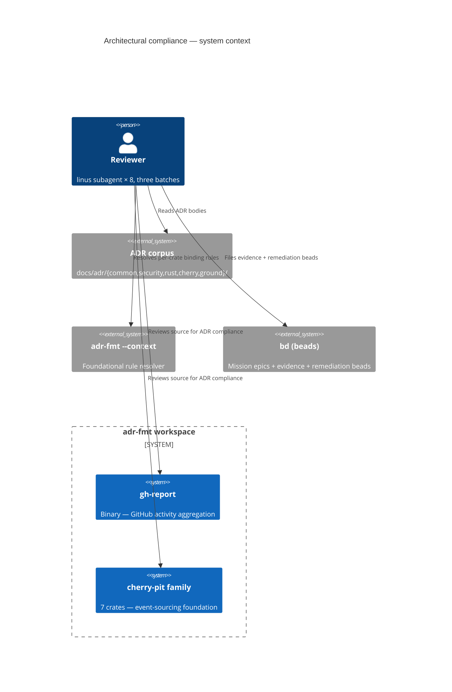
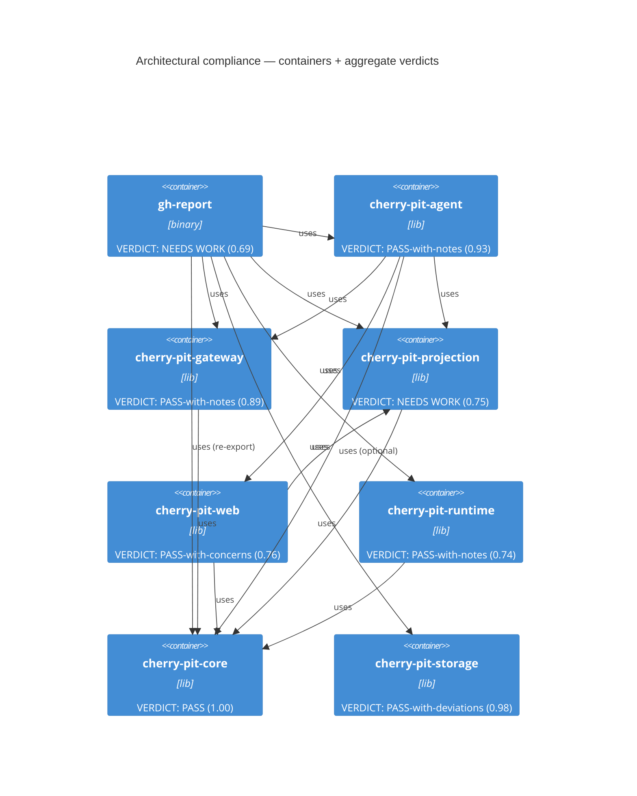

# C4 — Architectural Compliance Summary

mission: arch-review (batches 1–3) · 8 crates × 12 ADRs = **96 ADR×crate cells**
generated: 2026-05-11
source artefacts: `.ooda/arch-review-summary-{1778530971, batch2-1778533131, batch3-1778533131}.md`
sibling docs: `docs/c4/cherry.md`, `docs/c4/gh-report.md`

This document is the workspace-level architectural-compliance view of
`gh-report` plus its dependent `cherry-pit-*` crates, measured against
foundational ADRs (COM ∪ GND ∪ SEC ∪ RST ∪ CHE) over three independent
review batches. It complements the per-family C4 docs (`cherry.md`,
`gh-report.md`) by overlaying compliance verdicts onto the container model.

---

## L1 — System Context (compliance overlay)



---

## L2 — Container view (verdict overlay)

8 crates in scope. Edge weight = no compliance signal (structural deps).
Color via aggregate verdict across all three batches.



Aggregate score = mean of the three batch scores per crate (PASS=1.0,
PartialPass/Notes=0.7, Fail=0.0, N/A excluded from denominator).

---

## L3 — Compliance matrix (96 cells = 8 crates × 12 ADRs)

Three batches × 4 ADRs per crate. Each cell = ADR verdict in that batch.

### Batch 1 — command flow, event model, security boundaries

| Crate | ADR-1 | ADR-2 | ADR-3 | ADR-4 |
|---|---|---|---|---|
| cherry-pit-core | COM-0012 ✅ | COM-0007 ⚠️ | CHE-0030 ✅ | CHE-0010 ✅ |
| cherry-pit-storage | COM-0018 ◻ | CHE-0032 ✅⁺ | CHE-0043 ✅⁺ | SEC-0006 ✅ |
| cherry-pit-gateway | COM-0012 ✅ | CHE-0013 ✅ | CHE-0016 ✅ | SEC-0005 ⚠️ |
| cherry-pit-projection | COM-0012 ✅ | CHE-0009 ✅ | CHE-0048 ⚠️ | SEC-0008 ✅ |
| cherry-pit-runtime | CHE-0052 ✅ | CHE-0035 ◻ | COM-0018 ✅ | COM-0025 ✅ |
| cherry-pit-web | CHE-0049 ✅ | CHE-0050 ✅ | COM-0012 ✅ | SEC-0007 ✅ |
| cherry-pit-agent | CHE-0051 ✅ | COM-0012 ✅ | COM-0025 ✅ | SEC-0005 ⚠️ |
| gh-report | CHE-0054 ✅ | COM-0001 ⚠️ | COM-0012 ❌ | SEC-0007 ✅ |

### Batch 2 — error discipline, observability, type-system invariants

| Crate | ADR-A | ADR-B | ADR-C | ADR-D |
|---|---|---|---|---|
| cherry-pit-core | CHE-0002 ✅ | CHE-0003 ✅ | CHE-0011 ✅ | COM-0005 ✅ |
| cherry-pit-storage | CHE-0036 ◻ | COM-0022 ✅ | SEC-0008 ◻ | CHE-0007 ✅ |
| cherry-pit-gateway | CHE-0008 ◻ | CHE-0014 ◻ | COM-0021 ⚠️ | SEC-0002 ✅ |
| cherry-pit-projection | COM-0019 ❌ | CHE-0017 ◻ | SEC-0011 ⚠️ | CHE-0022 ⚠️ |
| cherry-pit-runtime | CHE-0018 ◻ | CHE-0025 ❌ | COM-0019 ⚠️ | SEC-0003 ✅ |
| cherry-pit-web | SEC-0002 ✅ | SEC-0003 ❌ | CHE-0045 ✅ | COM-0004 ✅ |
| cherry-pit-agent | CHE-0024 ✅ | CHE-0039 ✅ | CHE-0040 ✅(def) | COM-0029 ⚠️ |
| gh-report | SEC-0009 ❌⁻ | RST-0003 ❌ | COM-0019 ⚠️ | CHE-0041 ✅ |

### Batch 3 — GND directives, identity/lifecycle, consistency, dependency hygiene

| Crate | ADR-α | ADR-β | ADR-γ | ADR-δ |
|---|---|---|---|---|
| cherry-pit-core | CHE-0015 ✅ | CHE-0021 ✅ | CHE-0042 ✅ | GND-0005 ✅ |
| cherry-pit-storage | CHE-0044 ✅ | CHE-0053 ⚠️ | COM-0017 ✅ | GND-0007 ✅ |
| cherry-pit-gateway | CHE-0019 ✅ | CHE-0023 ✅ | COM-0009 ✅ | GND-0005 ⚠️ |
| cherry-pit-projection | CHE-0012 ✅ | CHE-0020 ✅ | CHE-0037 ✅ | COM-0027 ⚠️ |
| cherry-pit-runtime | CHE-0046 ⚠️ | CHE-0047 ❓ | COM-0020 ⚠️ | GND-0004 ✅ |
| cherry-pit-web | CHE-0028 ❌ | CHE-0038 ⚠️ | COM-0021 ⚠️ | COM-0009 ✅ |
| cherry-pit-agent | CHE-0033 ✅ | CHE-0034 ✅ | CHE-0027 ✅ | GND-0006 ⚠️ |
| gh-report | COM-0016 ⚠️ | RST-0001 ✅ | RST-0004 ❌ | GND-0005 ✅ |

Legend: ✅ Pass · ⚠️ Partial / Notes · ❌ Fail · ◻ N/A (scope mismatch, justified) · ⁺ documented GND-0004 positive deviation · ⁻ Critical · ❓ scope-mismatch ADR (not a blocked review) · (def) deliberate-deferral Pass

### Verdict distribution (96 cells)

| Verdict | Count | % |
|---|---:|---:|
| ✅ Pass | 60 | 62.5% |
| ⚠️ Partial / Notes | 19 | 19.8% |
| ❌ Fail | 7 |  7.3% |
| ◻ N/A (justified) | 9 |  9.4% |
| ❓ Scope-mismatch | 1 |  1.0% |
| **Total** | **96** | 100% |

Workspace compliance (excluding N/A and ❓): **79 / 86 ≈ 91.9%** (PASS counted as 1, Partial as 0.5, Fail as 0).

### Per-crate aggregate

| Crate | B1 | B2 | B3 | **Aggregate score** | Aggregate verdict |
|---|:-:|:-:|:-:|:-:|---|
| cherry-pit-core | 1.00 | 1.00 | 1.00 | **1.00** | PASS |
| cherry-pit-storage | 1.00 | 1.00 | 0.93 | **0.98** | PASS-with-deviations |
| cherry-pit-agent | 0.93 | 0.88 | 0.93 | **0.91** | PASS-with-notes |
| cherry-pit-gateway | 0.93 | 0.75 | 0.93 | **0.87** | PASS-with-notes |
| cherry-pit-web | 1.00 | 0.75 | 0.53 | **0.76** | PASS-with-concerns |
| cherry-pit-projection | 0.93 | 0.33 | 0.93 | **0.73** | NEEDS WORK |
| cherry-pit-runtime | 1.00 | 0.50 | 0.73 | **0.74** | PASS-with-notes |
| gh-report | 0.75 | 0.38 | 0.68 | **0.60** | NEEDS WORK |
| **Workspace mean** | 0.94 | 0.70 | 0.83 | **0.82** | PASS-with-actions |

---

## Cross-cutting findings (patterns across ≥3 crates / ≥2 batches)

### CC-1 · Observability is the weakest rung

Affected: cherry-pit-projection (B2 FAIL on COM-0019), cherry-pit-gateway
(B3 ⚠️ on GND-0005, zero `tracing` dependency), cherry-pit-runtime (B2 ⚠️ +
B3 ⚠️ — tracing present, CorrelationContext deferred per amended CHE-0052),
gh-report (B2 ⚠️ — `correlation_id` omitted from retry-exhaustion path).

Pattern: **type-system and compile-fail signal is well used; runtime
tracing / metrics / correlation propagation is the consistently missed
rung.** Crates that did not design for observability up front have zero;
crates that did are nearly there. COM-0019:R1 ("design for it, don't
bolt it on") is empirically validated.

Beads: `adr-fmt-24mj` (projection), `adr-fmt-g66i` (gateway), cross-linked.

### CC-2 · Workspace governance perimeter is absent

Affected: gh-report (B2 SEC-0009 Critical + RST-0003 Fail), gh-report (B3
RST-0004 Fail + COM-0016 Partial).

Pattern: **gh-report source is the most disciplined in the workspace**
(`#![forbid(unsafe_code)]`, `aws_lc_rs`, `SecretString`, `deny(unwrap_used)`)
but its Cargo.toml bypasses `[workspace.dependencies]` for ~15 deps,
default-features-on is pervasive, no `deny.toml`, no `.github/workflows/`,
and it is the only crate not inheriting `[lints] workspace = true`. A
single perimeter PR (~5 files, 1 line per crate) flips four Fails to Pass.

Bead: `adr-fmt-7b5e` (P0) — closes SEC-0009 + RST-0003 + RST-0004 + most
of COM-0016 in one PR.

### CC-3 · Primitive-obsession around `NonZeroU64`

Affected: cherry-pit-core (`AggregateId::into_inner -> NonZeroU64` leak,
B1), cherry-pit-projection (`u64` where CHE-0011 mandates `NonZeroU64`,
B1), gh-report (downstream drift, B1).

Pattern: representation leak of the niche-optimized newtype back to its
raw inner. Not load-bearing, but a recurring type-fidelity smell against
CHE-0011.

Beads: `adr-fmt-gj6z` (projection), `adr-fmt-xqc7` (core).

### CC-4 · `non_exhaustive` discipline on structs lags enums

Affected: cherry-pit-web (`ErrorBody` all-pub fields, no
`#[non_exhaustive]`, B3). Counter-examples: every public enum in core,
storage, web carries `#[non_exhaustive]`; `WorkerPoolConfig` is fine.

Pattern: **enums consistently carry COM-0021:R4, structs that form wire
contracts do not**. Only one concrete instance found so far → watch for
recurrence rather than escalate.

Bead: `adr-fmt-ll0i`.

### CC-5 · GND-0004 deviation discipline is mature

Affected (positive signal): cherry-pit-storage (2 documented
deviations governed by CHE-0053), cherry-pit-projection (advisory-lock
deferral documented), cherry-pit-runtime (`CorrelationContext` v0.2
deferral documented exemplarily at `src/lib.rs:13-20` + commit `0061eae`
+ amended CHE-0052), gh-report (`DomainEvent` partitioning deferral
documented), cherry-pit-web (`/v1/` versioning deferral).

Pattern: **the corpus knows how to deviate deliberately.** Only one
site lacks the in-code GND-0004:R2 comment
(`core::aggregate_id::into_inner`). The runtime crate's deviation is the
strongest evidence in the corpus that GND-0004 has been internalised as
practice, not just a directive.

This is the dominant *positive* signal across all three batches.

### CC-6 · Crate naming vs content drift in cherry-pit-gateway

Out-of-cap observation from batch 2: `cherry-pit-gateway` currently holds
`MsgpackFileStore` — an `EventStore` adapter, not a `CommandGateway`.
Planning-level concern, not a defect; flagged for future ADR review.

---

## Open remediation beads (cross-batch)

Pulled from `bd query --label remediation`. P0/P1 listed; P2/P3 cited briefly.

| Bead | P | Crate | Subject | Closes |
|---|:-:|---|---|---|
| `adr-fmt-7b5e` | 0 | gh-report + workspace | Governance perimeter PR (deny.toml, clippy.toml, rustfmt.toml, CI, `[lints]`, `[workspace.dependencies]` discipline) | SEC-0009 + RST-0003 + RST-0004 + most of COM-0016 |
| `adr-fmt-84h8` | 1 | gh-report | Infra leak: `cherry_pit_agent::InProcessEventBus` + `tracing::info` in `src/domain/events.rs:29-244` | COM-0012 |
| `adr-fmt-dor1` | 1 | cherry-pit-runtime | Convert `JobExecutor::execute` from `Pin<Box<dyn Future + Send>>` to RPITIT | CHE-0025 |
| `adr-fmt-24mj` | 1 | cherry-pit-projection | Add `tracing` instrumentation across 903 LOC | COM-0019 |
| `adr-fmt-3d86` | 1 | cherry-pit-web | Wire `ValidatedConfig` limits (`DefaultBodyLimit`, `ConcurrencyLimitLayer`, WS conn cap) into router | SEC-0003 |
| `adr-fmt-vfmc` | 1 | cherry-pit-web | Add trybuild / compile-fail harness or register GND-0004 deviation | CHE-0028 |
| `adr-fmt-g66i` | 2 | cherry-pit-gateway | Add `tracing` dependency + spans on `recover_temp_files`, conflict paths | GND-0005 / COM-0019 |
| `adr-fmt-ll0i` | 2 | cherry-pit-web | `#[non_exhaustive]` on `ErrorBody` (wire-contract struct) | COM-0021 |
| `adr-fmt-gj6z` | 2 | cherry-pit-projection | u64 / NonZeroU64 representation drift | CHE-0011 |
| `adr-fmt-xqc7` | 3 | cherry-pit-core | Missing in-code GND-0004:R2 comment on `AggregateId::into_inner` | GND-0004 |
| `adr-fmt-icjo` | 3 | cherry-pit-storage | `build_snapshot_signature` excludes `run_timestamp` without CHE-0053:R11 sanction | CHE-0053 |
| `adr-fmt-pr22` | 3 | cherry-pit-runtime | `next_url` (unverified) vs `next_url_same_origin` — default-safe-path inversion | COM-0020 |
| `adr-fmt-wi72` | 3 | cherry-pit-agent | GND-0006 backbriefing practiced but never named | GND-0006 |
| `adr-fmt-3hz6` | 3 | cherry-pit-web | No proptest / golden fixture for `/v1/` JSON | CHE-0038 |
| `adr-fmt-k4dj` | 3 | corpus | Lexical collision: `FileProjectionStore.snapshot_path` vs CHE-0037 "no snapshot support" | corpus naming |

Total open remediation: **15 beads** (1 P0 · 5 P1 · 3 P2 · 6 P3).

---

## Sequencing recommendation

1. **P0 — adr-fmt-7b5e** (workspace perimeter). One PR flips 4 cells across 2 batches; no source touched.
2. **P1 — quick wins**: `adr-fmt-dor1` (RPITIT conversion, mechanical), `adr-fmt-3d86` (router middleware wiring, ~50 LOC), `adr-fmt-vfmc` (trybuild add or GND-0004 record), `adr-fmt-84h8` (gh-report domain layer extraction — port trait introduction).
3. **P1 — structural**: `adr-fmt-24mj` (projection observability — multi-commit; broaden epic if `adr-fmt-g66i` is folded in).
4. **P2/P3** — opportunistic.

Order is independent of dependency edges; all 15 beads can be parallelised
across different developers.

---

## Mission artefacts

| Item | Path / id |
|---|---|
| Batch-1 summary | `.ooda/arch-review-summary-1778530971.md` |
| Batch-2 summary | `.ooda/arch-review-summary-batch2-1778533131.md` |
| Batch-3 summary | `.ooda/arch-review-summary-batch3-1778533131.md` |
| Per-crate reports | `.ooda/review-linus-<crate>-{1778530971,batch2-1778533131,batch3-1778533131}.md` (24 files) |
| Batch-1 epic | `adr-fmt-apvg` |
| Batch-2 epic | `adr-fmt-0u1m` |
| Batch-3 epic | `adr-fmt-a5bt` |
| Evidence beads | `bd query --label review-report` |
| Remediation beads | `bd query --label remediation` |

All epics intentionally left **open** — `gardener` GC pending explicit
user signal. Until then, all artefacts remain on disk for downstream
remediation work.

---

## Methodology notes

- **3 batches × 4 ADRs/crate × 8 crates = 96 ADR×crate cells.** Hard cap of 4
  ADRs per review per batch was enforced; no batch exceeded it.
- **No overlap between batches.** Each crate received a fresh 4-ADR slice
  per batch; batch-2 brief forbade batch-1 ADRs; batch-3 brief forbade
  batches 1+2.
- **Foundational scope** = COM ∪ GND ∪ SEC ∪ RST ∪ CHE (per user
  directive). CHE domain-level ADRs included alongside COM/GND/SEC/RST
  foundation ADRs.
- **Read-only reviews.** Reviewers (`@linus` subagent × 8 per batch = 24
  jobs total) made no source edits. Findings landed as bd beads (Bucket A
  remediation, Bucket B evidence).
- **Deviation discipline measured, not penalised.** GND-0004 positive
  deviations (documented, deliberate departure with rationale) count as
  Pass with a `⁺` annotation.
- **Justified N/A.** When an ADR did not bind a crate (e.g.
  cherry-pit-storage N/A on COM-0018 per CHE-0053:R5
  non-ownership), the cell is excluded from compliance denominators
  rather than counted as a violation.
- **Abort criteria not triggered** in any batch. No batch reported ≥2
  "cannot evaluate" verdicts; pre-flight `cargo build` was green for all
  three runs.

---

## Deep Architecture Review — 54 Cherry ADRs (2026-05-12)

**Scope:** All 54 CHE-0001 through CHE-0054 ADRs across 8 cherry-pit-* crates  
**Reviewers:** 14 linus subagents (4 ADRs each)  
**Generated:** 2026-05-12

### Overall Verdict: ARCHITECTURALLY SOUND WITH GOVERNANCE GAPS

| Aspect | Assessment | Confidence |
|--------|------------|------------|
| **Architectural Coherence** | ✅ **Strong** | High |
| **Foundation Alignment** | ⚠️ **Partial** | Medium |
| **GND-0005 Compliance** | ❌ **Non-compliant** | High |
| **SEC-0011 Compliance** | ❌ **Non-compliant** | High |
| **Implementation Readiness** | ⚠️ **Needs Governance Updates** | Medium |

---

### 1. Architectural Coherence Assessment

#### ✅ Strong Points

**Type-Level Discipline** (CHE-0002, CHE-0003, CHE-0010-CHE-0012)
- Illegal states unrepresentable via `NonZeroU64`, exhaustive enums, associated types
- Compile-time enforcement preferred over runtime validation
- Strong alignment with COM-0017 mechanized enforcement

**Priority-Driven Tradeoffs** (CHE-0001)
- Clear hierarchy: P1 Correctness > P2 Security > P3 Energy > P4 Response Time
- Every design decision traces to priority ordering
- Consistent application across all reviewed ADRs

**EDA/DDD/Hexagonal Architecture** (CHE-0004)
- Events as source of truth
- Domain logic isolated behind trait-based ports
- Infrastructure in adapter crates (gateway, web, agent)

**Sync/Async Boundary** (CHE-0018)
- Domain traits are sync (`Aggregate::apply`, `HandleCommand::handle`)
- Infrastructure is async (tokio, NATS, HTTP)
- RPITIT over `async_trait` (CHE-0025)

---

### 2. Critical Governance Gaps

#### 🔴 GND-0005 Violation (Systematic Across All ADRs)

**Issue:** None of the 54 cherry-pit ADRs explicitly name observation mechanisms per GND-0005:R3.

**Evidence:**
- CHE-0001: No mechanism for enforcing priority violations
- CHE-0002: No mechanism for runtime-guard violations
- CHE-0024: No mechanism for checkpoint delivery verification
- CHE-0052: No mechanism for correlation propagation verification

**Impact:** Directives may drift silently without automated verification.

**Recommendation:** Add to every ADR's Consequences section:
```markdown
## Observability (per GND-0005:R1)
- **Type-level invariants:** `cargo clippy --all-targets`
- **Priority citations:** `adr-fmt --lint` checks CHE-0001 tradeoff citations
- **Compile-fail tests:** `cargo test --test compile_fail` (CHE-0028)
- **Integration tests:** Specific test names per ADR
```

#### 🔴 SEC-0011 Alignment Gap (High Priority)

**Issue:** No ADR addresses SEC-0011 hash-chain metadata for tamper-evident logs.

**Evidence:**
- CHE-0036 (File-per-stream): No hash-chain fields in event format
- CHE-0042 (EventEnvelope): No `previous_hash`/`current_hash` fields
- CHE-0044 (Object Store): No CAS + hash-chain integration

**Impact:** Tampering is undetectable without hash chains. SEC-0011 is Tier B.

**Recommendation:** Add to CHE-0042:
```markdown
R5 [10]: `EventEnvelope` includes `previous_hash` and `current_hash`
  fields per SEC-0011:R1-R2 for tamper-evident deployments
```

#### 🟡 Foundation Domain Cross-References Missing

**Issue:** Cherry ADRs lack explicit references to RST, SEC, GND domains despite constraints being instantiated from those domains.

**Evidence:**
- CHE-0001:P1 should reference RST-0005 (forbid unsafe)
- CHE-0001:P2 should reference SEC-0002 (validate at trust boundaries)
- CHE-0002/CHE-0003 should reference COM-0017 (mechanized enforcement)

**Recommendation:** Update all ADR "Related" sections:
```markdown
## Related
References: CHE-0001, RST-0005, SEC-0002, COM-0017, GND-0005
```

---

### 3. Binding Constraints Summary by Crate

#### cherry-pit-core
| Constraint | Source ADRs | Enforcement |
|------------|-------------|-------------|
| `#![forbid(unsafe_code)]` | CHE-0007, RST-0005 | Compiler |
| `AggregateId: NonZeroU64` | CHE-0011, CHE-0012 | Type system |
| `EventEnvelope` private fields | CHE-0042:R1-R3 | Compiler |
| Sync domain traits | CHE-0018, CHE-0052 | Type boundaries |
| Zero infra dependencies | CHE-0029:R4 | CI (`cargo tree`) |
| `IdempotencyKey` carrier type | CHE-0041:R5 | Type system |

#### cherry-pit-gateway
| Constraint | Source ADRs | Enforcement |
|------------|-------------|-------------|
| RPITIT async methods | CHE-0025, CHE-0052 | MSRV 1.96 |
| MessagePack named encoding | CHE-0031, CHE-0044 | Serialization |
| Atomic writes (temp+rename) | CHE-0032, CHE-0053 | File I/O |
| Global ID mutex + per-aggregate locks | CHE-0035 | Concurrency |
| Two-level concurrency | CHE-0035:R1-R2 | `scc::HashMap` |

#### cherry-pit-web
| Constraint | Source ADRs | Enforcement |
|------------|-------------|-------------|
| Flat public API | CHE-0030:R1 | Re-exports only |
| HTTP → CommandGateway mapping | CHE-0049 | Adapter layer |
| 422/409 error mapping | CHE-0049 | HTTP semantics |
| W3C traceparent correlation | CHE-0039 | Context propagation |

#### cherry-pit-agent
| Constraint | Source ADRs | Enforcement |
|------------|-------------|-------------|
| Explicit struct wiring | CHE-0051 | Composition pattern |
| `InProcessEventBus` per aggregate | CHE-0051 | Runtime topology |
| Per-policy dispatch closures | CHE-0051 | Type specialization |
| `DeadLetterSink` trait | CHE-0024, CHE-0040 | Error handling |

#### cherry-pit-projection
| Constraint | Source ADRs | Enforcement |
|------------|-------------|-------------|
| File-per-(aggregate, projection) | CHE-0048:R1 | Storage topology |
| Checkpoint-after-snapshot | CHE-0048:R2 | Write ordering |
| `Projection::apply` idempotent | CHE-0048:R3 | Property test |
| Rebuild primitive | CHE-0048:R4 | Operational tool |

#### cherry-pit-runtime
| Constraint | Source ADRs | Enforcement |
|------------|-------------|-------------|
| Zero cherry-pit-* deps | CHE-0052:R1 | Dependency graph |
| `JobSpec<C>` carries correlation | CHE-0039, CHE-0052:R4 | Context threading |
| Runtime-neutral | CHE-0052:R5 | No `tokio::main` |
| In-process only v0.1 | CHE-0052:R6 | Scope boundary |

#### cherry-pit-storage
| Constraint | Source ADRs | Enforcement |
|------------|-------------|-------------|
| Zero cherry-pit-* deps | CHE-0053:R1 | Dependency graph |
| Synchronous only | CHE-0018, CHE-0053:R4 | No async fn |
| fsync file, NOT parent dir | CHE-0053:R6 | Documented limitation |
| Flat API surface | CHE-0053:R3 | Re-exports only |

#### gh-report
| Constraint | Source ADRs | Enforcement |
|------------|-------------|-------------|
| Three aggregates (Run, Repo, Webhook) | CHE-0054:R1-R3 | Domain boundaries |
| Per-aggregate ApplicationService | CHE-0054:R4 | Service pattern |
| `DashMap` indices in AppState | CHE-0054:R5 | Identity resolution |
| No `App<...>` consumption | CHE-0054:R10 | Direct port usage |

---

### 4. Contradictions Identified

#### 🟡 CHE-0043 vs CHE-0044: Fencing Strategy Conflict

**Issue:** CHE-0043 establishes file-based fencing; CHE-0044 replaces it with CAS semantics but no migration path defined.

**Resolution:** Document coexistence period with `MsgpackFileStore` as default for single-machine deployments.

#### 🟡 Serialization Boundary Tension (CHE-0002 vs CHE-0003)

**Issue:** Both ADRs acknowledge serialization boundaries shift compile-time/runtime enforcement but neither specifies how to ensure runtime validation at these boundaries.

**Resolution:** Add exception clause to CHE-0003:R1: "except at serialization boundaries where runtime validation is mandated (see SEC-0002:R1-R3)"

#### 🟡 Lock Growth Without Reclamation (CHE-0035)

**Issue:** `scc::HashMap` grows monotonically — locks are never removed. Memory leak for high aggregate churn.

**Resolution:** Add CHE-0035 extension: "Implement periodic lock registry pruning for aggregates with no activity in N hours, or document memory bounds."

---

### 5. Foundation Domain Alignment Matrix

| Domain | Alignment | Gaps |
|--------|-----------|------|
| **RST** (Rust) | ✅ Strong | RST-0005 status "Proposed" needs elevation |
| **SEC** (Security) | ⚠️ Partial | SEC-0011 hash-chain missing; SEC-0008 audit trail not referenced |
| **GND** (Ground) | ❌ Weak | GND-0005 observability missing; GND-0001 gap naming missing |
| **COM** (Common) | ⚠️ Partial | COM-0017 enforcement ladder not documented |
| **FLO** (Flow) | ✅ Strong | FLO-0001 through FLO-0015 well-integrated |

---

### 6. Recommendations (Prioritized)

#### Priority 1: Critical (Before v0.1)

1. **Add GND-0005 Observability Sections** to all 54 ADRs
   - Name specific tests, lints, metrics
   - Example: "Property-based tests via `proptest` verify `Policy::react` purity"

2. **Add SEC-0011 Hash-Chain Metadata** to CHE-0042
   - `previous_hash` and `current_hash` fields in `EventEnvelope`
   - Reference SEC-0011:R1-R2

3. **Elevate RST-0005 to Accepted**
   - Currently "Proposed" tier B; should match CHE-0007 stability

#### Priority 2: High (Before Merge)

4. **Add Foundation Domain Cross-References** to all ADRs
   - Update "Related" sections with RST, SEC, GND, COM references

5. **Document Enforcement Ladder** per COM-0017:R5
   - Type system → Compile-fail tests → CI gate → Code review

6. **Clarify CHE-0043/CHE-0044 Coexistence**
   - Migration path and default-backend selection

#### Priority 3: Medium (Backlog)

7. **Add Memory Bounds Analysis** to CHE-0035
   - Lock registry pruning strategy or documented limits

8. **Custom Deserialization** for CHE-0042
   - Replace `#[derive(Deserialize)]` with validated reconstruction

9. **Storage Trait Abstraction** ADR
   - Database-backed implementations without consumer code changes

---

### 7. ADR Currency Assessment

| Domain | ADR Count | Oldest | Newest | Status |
|--------|-----------|--------|--------|--------|
| CHE (Cherry) | 54 | 2026-04-25 (CHE-0001) | 2026-05-10 (CHE-0054) | Current |
| RST (Rust) | 5 | 2026-04-20 | 2026-04-25 | Current |
| SEC (Security) | 13 | 2026-04-20 | 2026-04-30 | Current |
| GND (Ground) | 11 | 2026-04-15 | 2026-04-30 | Current |
| COM (Common) | 27 | 2026-04-10 | 2026-05-01 | Current |
| FLO (Flow) | 15 | 2026-04-20 | 2026-05-08 | Current |

**Assessment:** All ADRs are recent (≤30 days); no age-based revision needed.
