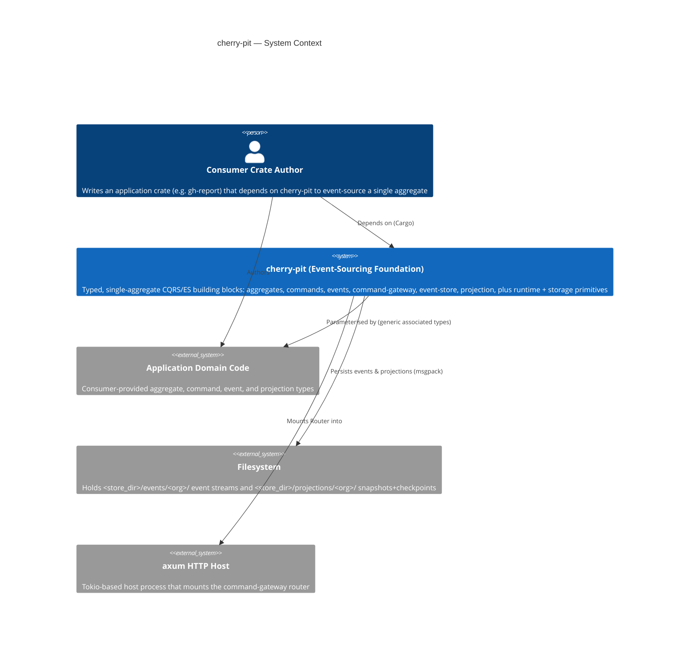
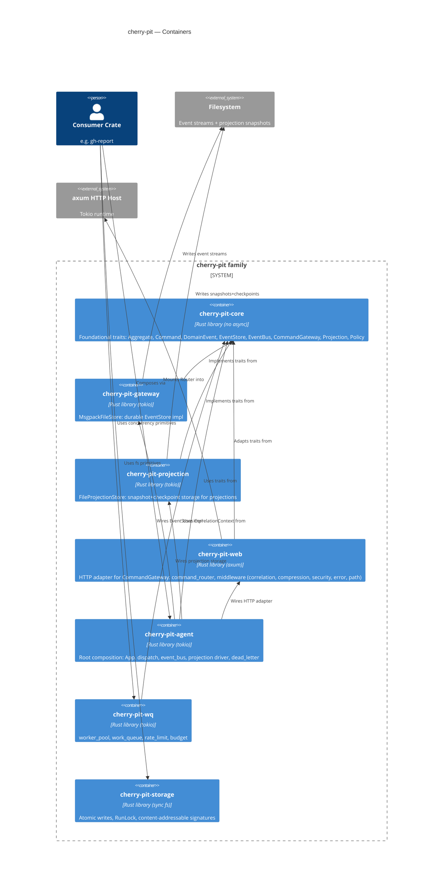
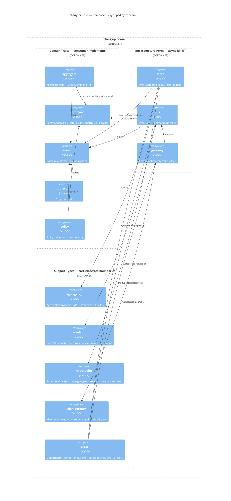
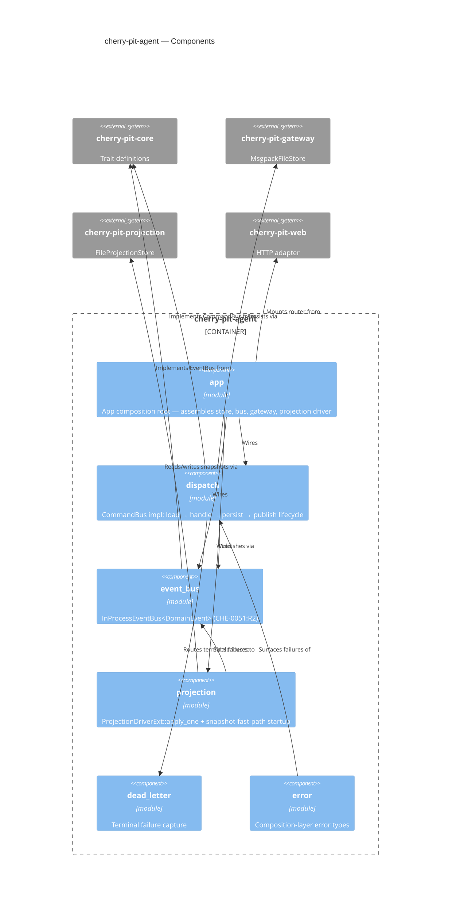

# C4 — cherry-pit family

The **cherry-pit** family is a typed event-sourcing / CQRS foundation
shipped as a set of Rust crates in this workspace. Its design posture
(per `crates/cherry-pit-core/src/lib.rs:10–22`) is **single-aggregate per
infrastructure stack**: every port (`EventStore`, `EventBus`,
`CommandBus`, `CommandGateway`) is bound to a single aggregate type via
associated types, so the compiler enforces end-to-end type safety from
command dispatch through event persistence and publication.

The family is consumed by application crates such as `gh-report`
(see `docs/c4/gh-report.md`).

Crates physically present in `crates/`:

| Crate | Role |
|---|---|
| `cherry-pit-core` | Foundational traits — no async runtime, no infrastructure |
| `cherry-pit-gateway` | Durable `EventStore` impl (`MsgpackFileStore`) |
| `cherry-pit-projection` | Projection drivers + `FileProjectionStore` |
| `cherry-pit-web` | HTTP adapter for `CommandGateway` over axum |
| `cherry-pit-agent` | Root composition crate wiring core/gateway/projection/web |
| `cherry-pit-wq` | Worker pool, work queue, rate limit, budget |
| `cherry-pit-storage` | Atomic write, run-lock, content-addressable signature |

---

## L1 — System Context

---

## L2 — Container (one container per crate)

Edges are taken verbatim from each crate's `Cargo.toml` `[dependencies]`
block. `cherry-pit-storage` is intentionally a leaf: it
has no cherry-pit-* dependencies and is consumed directly by application
crates (e.g. `gh-report`).

---

## L3 — Component

Scoped to the two crates with the largest internal surface
(`cherry-pit-core` and `cherry-pit-agent`). The remaining crates are
either single-file (`cherry-pit-projection/src/lib.rs`) or thin module
sets adequately captured at the L2 layer.

### cherry-pit-core components

One component per `crates/cherry-pit-core/src/*.rs` module (verified
present at the time of writing). Grouped by concern: **Domain Traits**
(what consumers implement), **Infrastructure Ports** (what consumers
depend on, async RPITIT), **Support Types** (data carried across
boundaries).

### cherry-pit-agent components

One component per `crates/cherry-pit-agent/src/*.rs` module.

---

## L4 — Cross-cutting flow: command → event → projection → web GET

End-to-end flow through every cherry-pit crate, including the error
paths and a representative consumer-side webhook ingress lane (drawn
from `gh-report`, since no `cherry-pit-*` crate ships a webhook
surface). Verified against current source at the time of writing
(`crates/cherry-pit-core/src/bus.rs`, `…/error.rs`;
`crates/cherry-pit-agent/src/{dispatch,projection,app}.rs`;
`crates/cherry-pit-web/src/projection/{handlers,port}.rs`;
`crates/cherry-pit-wq/src/{work_queue,worker_pool}.rs`;
`crates/gh-report/src/webhook/{mod,events,signature}.rs`;
`crates/gh-report/src/app/{daemon,collect,services/repo_service}.rs`).

Lane colour convention: Webhook (yellow), Scheduled Batch (pink),
Work Queue (cyan), Worker Pool + Delivery (light blue), Command
(blue), Event (green), Projection (orange), Web (purple), Error
(red). Error categorisation collapses to two terminal classes per
`ErrorCategory`: **Retryable** (caller retries; events may already be
persisted) and **Terminal** (caller cannot recover; routed to
dead-letter sink where applicable).

```mermaid
flowchart TD
    %% ---------- Webhook ingress (consumer-side example: gh-report) ----------
    subgraph WH["Webhook Ingress — consumer-side example (gh-report)"]
        direction TB
        WHREQ[/"POST /webhooks/github<br/>X-Hub-Signature-256, X-GitHub-Event,<br/>X-GitHub-Delivery"/]
        WHLIMIT["RequestBodyLimitLayer (1 MiB)"]
        WHSIG["verify_signature (HMAC-SHA256,<br/>constant-time)"]
        WHCORR["CorrelationContext::none()<br/>(TODO WU-8.5b: seed from delivery UUID)"]
        WHMAP["map_event_to_action(event, payload)<br/>→ WebhookAction"]
        WHREPLAY["replay-cache check-and-insert<br/>(moka, 100k cap, 1h TTL)"]
        WHACT{"WebhookAction"}
        WHDEB["push-debounce (5s per repo)<br/>execute_enqueue branch, push events only"]
        WH200[["200 OK — replay hit /<br/>Ignore / debounced"]]
        WH202[["202 Accepted — job enqueued"]]
        WH400[["400 Bad Request (malformed)"]]
        WH401[["401 Unauthorized (bad HMAC)"]]
        WH503w[["503 Service Unavailable<br/>(WorkQueue full)"]]
    end

    %% ---------- Scheduled batch producer (consumer-side) ----------
    subgraph SCH["Scheduled Batch — consumer-side (gh-report collect)"]
        direction TB
        SCHRUN["collect::run<br/>enqueue_batch(items, ScheduledBatch, corr)"]
        SCHTRK["BatchTracker (atomic countdown + Notify)<br/>completes when all jobs delivered"]
    end

    %% ---------- Work queue (cherry-pit-wq) ----------
    subgraph WQ["Work Queue — cherry-pit-wq"]
        direction TB
        WORKQ["WorkQueue&lt;C&gt;::enqueue(JobSpec)<br/>bounded mpsc + scc::HashSet dedup on domain_key"]
        WQRES{"EnqueueResult"}
    end

    %% ---------- Worker pool + delivery (cherry-pit-wq + consumer) ----------
    subgraph WORK["Worker Pool + Delivery — cherry-pit-wq + consumer"]
        direction TB
        DEQ["WorkQueue::dequeue()<br/>(N workers, default 16)"]
        BGATE["BudgetGate::acquire<br/>(CAS + epoch cooldown)"]
        RGATE["RateLimitState gate<br/>(pause on remaining ≤ HALT_THRESHOLD)"]
        EXEC["JobExecutor::execute<br/>(consumer impl, e.g. LiveEvaluator.evaluate)"]
        OTX["outcome_tx.send(JobOutcome)<br/>mpsc to delivery task"]
        DLV["delivery_loop (single task,<br/>sole JobOutcome consumer)"]
        REC["repo_service.record_evaluation<br/>(RecordEvaluation cmd; load→handle→append→publish)"]
        TRKDONE["BatchTracker.complete_one<br/>(ScheduledBatch jobs only)"]
    end

    %% ---------- Command layer ----------
    subgraph CMD["Command Layer — cherry-pit-core + caller-provided gateway"]
        direction TB
        U[Caller / HTTP command router]
        CG["CommandGateway::dispatch<br/>(id, cmd, CorrelationContext)"]
        CB["CommandBus::dispatch<br/>load → handle → persist → publish"]
        LD["EventStore::load(id)<br/>→ Vec&lt;EventEnvelope&gt;"]
        AGG["Aggregate::apply* replay<br/>reconstruct state"]
        HC["HandleCommand::handle(cmd)<br/>→ Vec&lt;Event&gt;"]
        ES["EventStore::append<br/>(id, expected_sequence, events, ctx)"]
        ENV["EventEnvelope&lt;E&gt;<br/>{event_id, aggregate_id, sequence,<br/>timestamp, correlation_id, causation_id}"]
    end

    %% ---------- Event layer ----------
    subgraph EVT["Event Layer — cherry-pit-core + cherry-pit-agent"]
        direction TB
        EB["EventBus::publish(envelopes)<br/>(InProcessEventBus)"]
        APPRUN["App::run publish loop<br/>(cherry-pit-agent)"]
        D1["dispatch_one(policies, envelope, gateway, dead_letter)"]
        CF["correlation_for(env.correlation_id, env.event_id)<br/>→ fresh CorrelationContext per dispatch"]
        REACT["Policy::react(envelope)<br/>→ Vec&lt;Policy::Output&gt;"]
        CLO["user dispatch closure<br/>Fn(Output, &amp;G, CorrelationContext) → Future"]
    end

    %% ---------- Projection layer ----------
    subgraph PROJ["Projection Layer — cherry-pit-agent + cherry-pit-projection"]
        direction TB
        PEXT["ProjectionDriverExt::apply_one<br/>(driver, &amp;mut projection, envelope)"]
        PAPPLY["Projection::apply(&amp;mut self, envelope)<br/>(consumer-defined fold)"]
        PSTATE["Consumer-owned projection state<br/>e.g. HashMap&lt;String, PageEntry&gt;"]
        PSRC["ProjectionSource (cherry-pit-web port)<br/>snapshot() / subscribe() / is_ready()"]
        BCAST["broadcast::Sender&lt;PageUpdate&gt;<br/>(consumer publishes deltas)"]
    end

    %% ---------- Web layer ----------
    subgraph WEB["Web Layer — cherry-pit-web (feature = projection)"]
        direction TB
        ROUTER["build_projection_router&lt;P&gt;<br/>axum::Router (typed, no dyn)"]
        GET["GET /v1/{*path}<br/>snapshot_get handler"]
        SNAP["state.source().snapshot()<br/>→ Option&lt;Arc&lt;HashMap&gt;&gt;"]
        RP["resolve_page(snapshot, key)<br/>direct → {key}/index.html → {key}.html"]
        SERVE["serve_page(page, headers)<br/>ETag/304, zstd negotiation"]
        RESP200[["200 OK — PageEntry body<br/>+ Content-Type + ETag"]]
        RESP304[["304 Not Modified"]]
        RESP404[["404 Not Found"]]
        RESP503[["503 Service Unavailable"]]

        WS["GET /ws → ws_handler / ws_session"]
        RECV["broadcast::Receiver::recv()"]
        WSFRAME[["WS text frame<br/>{v:1, type:'delta', ...}"]]
        WSCLOSE[["WS Close 1001 Going Away<br/>(drop-and-resync)"]]
    end

    %% ---------- Error sinks ----------
    subgraph ERR["Error Paths — ErrorCategory"]
        direction TB
        RETRY[/"Retryable<br/>(caller retries; events may be persisted)"/]
        TERM[/"Terminal<br/>(caller cannot recover)"/]
        DLS["DeadLetterSink::record<br/>(cherry-pit-agent)"]
    end

    %% ===== Webhook ingress flow =====
    WHREQ --> WHLIMIT
    WHLIMIT --> WHSIG
    WHSIG -.->|"fail"| WH401
    WHSIG -->|"ok"| WHCORR
    WHCORR --> WHMAP
    WHMAP -.->|"parse error<br/>(pre-replay, no burn)"| WH400
    WHMAP -->|"ok"| WHREPLAY
    WHREPLAY -.->|"hit"| WH200
    WHREPLAY -->|"miss"| WHACT
    WHACT -.->|"Ignore"| WH200
    WHACT -->|"Enqueue"| WHDEB
    WHDEB -.->|"within window<br/>(push events)"| WH200
    WHDEB -->|"out of window /<br/>non-push event"| WORKQ

    %% ===== Scheduled batch producer flow =====
    SCHRUN --> WORKQ
    SCHRUN --> SCHTRK

    %% ===== Work queue → result branches =====
    WORKQ --> WQRES
    WQRES -.->|"Accepted"| WH202
    WQRES -.->|"Deduplicated"| WH200
    WQRES -.->|"QueueFull"| WH503w

    %% ===== Worker pool + delivery flow =====
    WQRES -->|"Accepted: job in queue"| DEQ
    DEQ --> BGATE
    BGATE --> RGATE
    RGATE --> EXEC
    EXEC -->|"Ok(R) → JobOutcome::Success<br/>Err(String) → JobOutcome::Failure"| OTX
    OTX --> DLV
    DLV --> REC
    DLV -.->|"source = ScheduledBatch"| TRKDONE
    TRKDONE -.-> SCHTRK
    REC -->|"dispatches RecordEvaluation"| CG

    %% ===== Command flow =====
    U -->|"dispatch"| CG
    CG -->|"wraps"| CB
    CB --> LD
    LD --> AGG
    AGG --> HC
    HC -->|"OK: events"| ES
    HC -.->|"Err: domain rejection"| TERM
    ES -->|"OK: envelopes"| ENV
    ES -.->|"Err: ConcurrencyConflict /<br/>StoreLocked / Infrastructure"| RETRY
    ES -.->|"Err: CorruptData"| TERM
    ENV --> EB

    %% ===== Event flow =====
    EB -->|"OK"| APPRUN
    EB -.->|"BusError (always retryable;<br/>events already persisted)"| RETRY
    APPRUN --> D1
    D1 --> CF
    CF --> REACT
    REACT -->|"per Output"| CLO
    CLO -.->|"Err: Retryable<br/>(propagate to caller)"| RETRY
    CLO -.->|"Err: Terminal"| DLS
    DLS --> TERM

    %% ===== Projection flow =====
    APPRUN --> PEXT
    PEXT --> PAPPLY
    PAPPLY --> PSTATE
    PSTATE -->|"snapshot ready"| PSRC
    PSTATE -->|"delta published"| BCAST

    %% ===== Web GET flow =====
    PSRC --> ROUTER
    ROUTER --> GET
    GET --> SNAP
    SNAP -->|"None"| RESP503
    SNAP -->|"Some(Arc&lt;HashMap&gt;)"| RP
    RP -->|"miss"| RESP404
    RP -->|"hit"| SERVE
    SERVE -->|"If-None-Match matches"| RESP304
    SERVE -->|"fresh"| RESP200

    %% ===== Web WS flow =====
    BCAST --> RECV
    ROUTER --> WS
    WS --> RECV
    RECV -->|"Ok(PageUpdate)"| WSFRAME
    RECV -.->|"Err: Lagged"| WSCLOSE
    RECV -.->|"Err: Closed"| WSCLOSE

    %% ===== Styling =====
    classDef cmd fill:#dbeafe,stroke:#1e40af,color:#1e3a8a;
    classDef evt fill:#dcfce7,stroke:#166534,color:#14532d;
    classDef prj fill:#ffedd5,stroke:#9a3412,color:#7c2d12;
    classDef web fill:#ede9fe,stroke:#6d28d9,color:#4c1d95;
    classDef err fill:#fee2e2,stroke:#b91c1c,color:#7f1d1d;
    classDef resp fill:#f5f5f4,stroke:#525252,color:#1c1917;
    classDef wh fill:#fef9c3,stroke:#a16207,color:#713f12;
    classDef wq fill:#cffafe,stroke:#0e7490,color:#155e75;
    classDef wk fill:#e0f2fe,stroke:#0369a1,color:#0c4a6e;
    classDef sch fill:#fce7f3,stroke:#9d174d,color:#831843;

    class U,CG,CB,LD,AGG,HC,ES,ENV cmd;
    class EB,APPRUN,D1,CF,REACT,CLO evt;
    class PEXT,PAPPLY,PSTATE,PSRC,BCAST prj;
    class ROUTER,GET,SNAP,RP,SERVE,WS,RECV web;
    class RETRY,TERM,DLS err;
    class RESP200,RESP304,RESP404,RESP503,WSFRAME,WSCLOSE,WH200,WH202,WH400,WH401,WH503w resp;
    class WHREQ,WHLIMIT,WHSIG,WHCORR,WHMAP,WHREPLAY,WHDEB,WHACT wh;
    class WORKQ,WQRES wq;
    class DEQ,BGATE,RGATE,EXEC,OTX,DLV,REC,TRKDONE wk;
    class SCHRUN,SCHTRK sch;
```

### Key invariants surfaced by the flow

- **Persist-before-publish.** `CommandBus` MUST NOT call `EventBus::publish`
  unless `EventStore::append` succeeded. A `BusError` after persistence
  is `Retryable` and non-fatal — tracking-style downstream catches up
  from the store.
- **Fresh CorrelationContext per dispatch.** `correlation_for` constructs
  a new context per envelope; no `Default`, no shared/cached value.
  When the envelope has no upstream `correlation_id`, the dispatcher
  seeds a fresh chain from `event_id` and emits a `tracing::debug!`
  line so chain-seed creation is observable.
- **Terminal vs Retryable bifurcation.** Every framework error type
  (`DispatchError`, `StoreError`, `BusError`, agent `AgentError`)
  exposes `category() -> ErrorCategory`. Terminal errors from policy
  output dispatch enter the dead-letter sink once; Retryable errors
  propagate to the caller for retry orchestration.
- **Read-side decoupling.** The web layer never touches `EventStore`
  or `EventBus` directly. `ProjectionSource` is the only surface;
  consumer code is responsible for keeping the source's snapshot and
  broadcast channel current from the agent's projection apply path.
- **Drop-and-resync over replay.** WebSocket lag (broadcast `Lagged`)
  closes the socket with code 1001; the client recovers by re-fetching
  the HTTP snapshot and re-attaching a fresh WS — the snapshot is the
  durable checkpoint, not the broadcast stream.
- **Webhook ingress is consumer-side and fire-and-forget.** Neither
  `cherry-pit-web` nor any other `cherry-pit-*` crate exposes a webhook
  surface — the lane shown above is a `gh-report` example to make the
  realistic primary entry path explicit. The webhook handler verifies
  HMAC, maps the event to a `WebhookAction` **before** burning a
  replay-cache slot (so malformed payloads don't poison the cache),
  applies a 5-second per-repo debounce on push events, and enqueues a
  `JobSpec` into `cherry-pit-wq`'s `WorkQueue` as
  `JobSource::External { id: delivery_id, kind: event_type }`. The
  handler returns immediately (202 / 200 / 503) — it does **not** call
  `CommandGateway` directly. The corresponding `RecordEvaluation`
  domain command is dispatched **later**, by the single-task
  `delivery_loop` that consumes `JobOutcome` from the worker pool. In
  the current code path correlation on the `JobSpec` is
  `CorrelationContext::none()`; threading the delivery UUID through
  the chain is tracked as WU-8.5b.
- **WorkQueue dedup is FIFO + key-pending-set.** `cherry-pit-wq`'s
  `WorkQueue<C>::enqueue` rejects a `JobSpec` whose `domain_key` is
  already in the pending set (between enqueue and dequeue) by returning
  `EnqueueResult::Deduplicated` — the producer translates that into
  HTTP 200. Once a worker dequeues, the slot is released; a new job
  for the same key may then be enqueued even while the previous one
  is still executing. Two concurrent enqueues for the same key can
  both pass the `scc::HashSet::insert` check (benign race) — the
  worker's idempotency contract absorbs the duplicate.

---

## Notes & non-goals

- `cherry-pit-wq` and `cherry-pit-storage` are leaf
  utility crates whose internal module sets (worker_pool / work_queue
  / rate_limit / budget; fs / lock / signature / error) are adequately
  captured at the L2 layer. The L4 diagram surfaces `cherry-pit-wq`'s
  externally-visible flow (queue + worker pool + delivery handoff)
  because gh-report's webhook and scheduled-batch paths both terminate
  in the command bus via that lane.
- `cherry-pit-projection` is single-file (`src/lib.rs`); no L3 block
  is rendered for it.
- `cherry-pit-web` has 17+ modules with nested `middleware/` and
  `projection/` subdirectories. Its read-side surface is captured by
  the L4 flow diagram above (snapshot_get + ws_session paths); the
  command-router and middleware stack are mounted alongside but are
  not on the command → event → projection → web GET path under
  analysis here.
- L3 coverage is intentionally limited to `cherry-pit-core` and
  `cherry-pit-agent`, the two crates with the largest internal trait
  surface. The L4 flow diagram covers cross-crate concerns that L3
  cannot express within a single Container_Boundary.
- No code-level (L4-as-class-diagram) views. Generated code-level
  diagrams drift fastest; treat `rustdoc` as the source of truth at
  that grain.
- The diagrams describe **physical crates present in `crates/`**, not
  aspirational entries in `adr-fmt.toml`.
