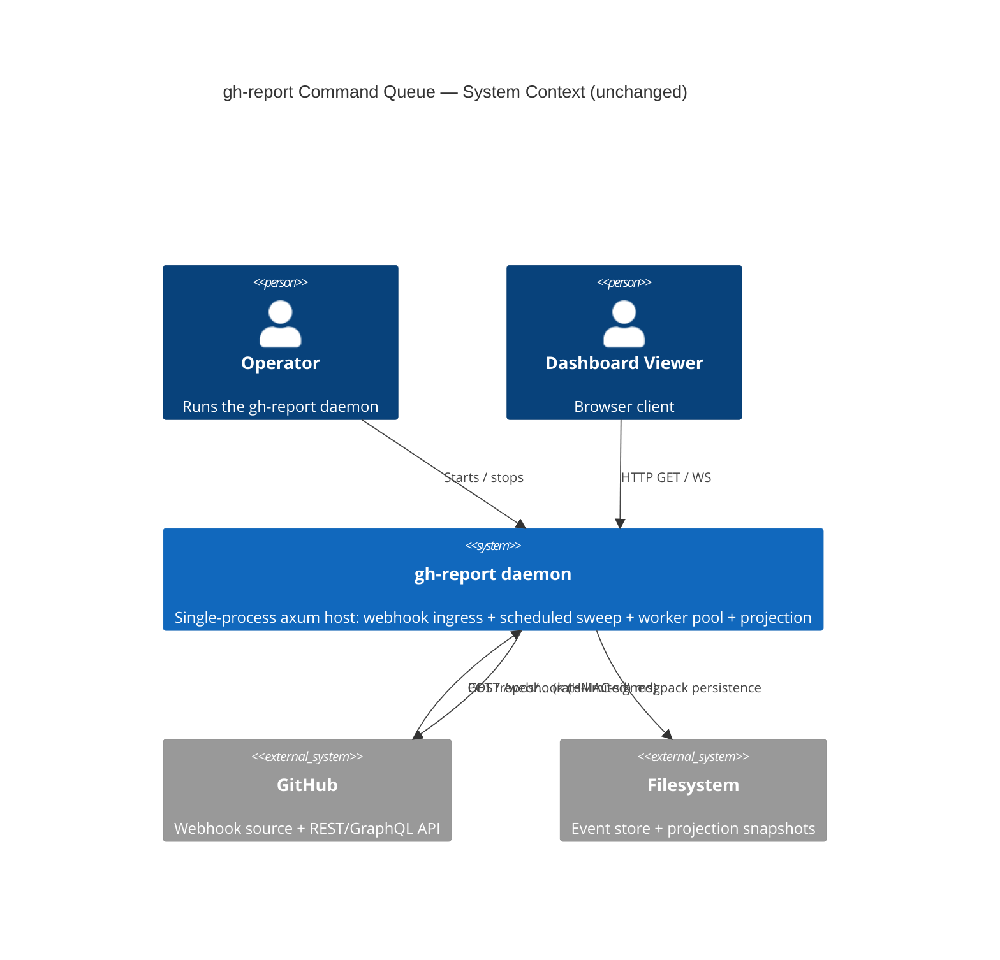
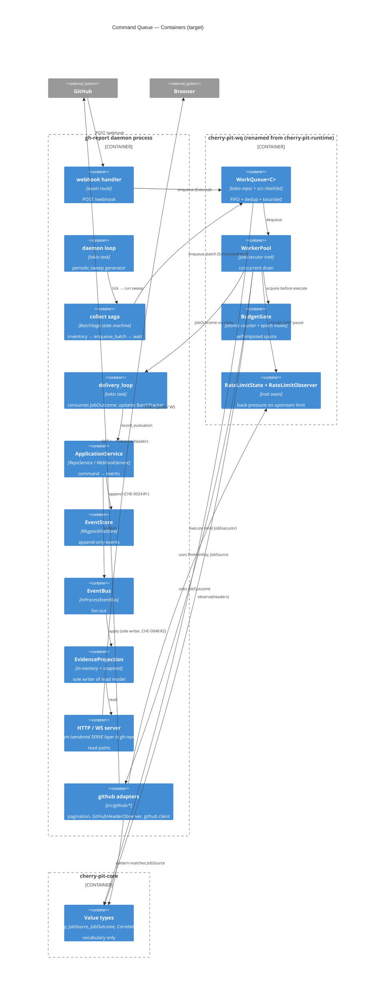

# C4 — Command Queue (Target Architecture Proposal)

**Status:** **Ratified** — user-ratified 2026-05-13 alongside CHE-0055
(Accepted). Oracle pre-ratified 2026-05-12 (bead `adr-fmt-zv0j`, artefact
`.ooda/oracle-cmd-queue-target-ratification.md`). This document remains the
C4-level companion to CHE-0055; structural decisions herein are now binding
per the successor ADR.
**Scope:** The in-process command queue used by `gh-report` and shipped as a
shared cherry-pit primitive.
**Companion docs:** [`cherry.md`](cherry.md) (cherry-pit family overview),
[`gh-report.md`](gh-report.md) (gh-report container).
**Supersedes (informally, on acceptance):** the implicit layering recorded
by `crates/cherry-pit-runtime/` (`cherry.md:23`).

This document proposes a refactor of the command-queue surface today in
`cherry-pit-runtime` into a properly named, properly layered set of crates,
and records the resulting target architecture. Behaviour is preserved
end-to-end; the change is structural (crate boundaries, type ownership,
one new trait seam) plus one behavioural extraction (`RateLimitObserver`
trait — moves GitHub-specific header parsing out of the shared crate).

---

## Motivation

The current `cherry-pit-runtime` crate (`crates/cherry-pit-runtime/src/lib.rs:1–87`)
bundles five modules — `work_queue`, `worker_pool`, `budget`, `rate_limit`,
`pagination` — under the docstring *"domain-agnostic concurrency and
resource-pacing primitives"*. Three structural problems:

1. **Name vs. contents mismatch.** `cherry-pit-runtime` is too vague; the
   crate is in fact a worker-pool back-pressure stack. After `pagination`
   leaves (see #2) the crate name `cherry-pit-wq` describes the contents.
2. **`pagination` is an HTTP adapter, not a primitive.** `next_url` /
   `next_url_same_origin` (`crates/cherry-pit-runtime/src/pagination.rs`)
   parse RFC 5988 `Link:` headers — a GitHub REST concern with no link
   to the queue or the worker pool. It belongs in the application crate
   that uses it (`gh-report`).
3. **`rate_limit` hardcodes GitHub's header shape.**
   `RateLimitState::update_from_headers` (`crates/cherry-pit-runtime/src/rate_limit.rs:89`)
   reads `x-ratelimit-limit` / `x-ratelimit-remaining` directly. The
   thresholds are configurable (`with_thresholds`,
   `crates/cherry-pit-runtime/src/rate_limit.rs:76`); the *observation
   source* is not. A second consumer with a different header convention
   (e.g. `RateLimit-Reset` per draft-ietf-httpapi-ratelimit-headers, or
   a non-HTTP signal) cannot reuse the state machine without forking.

A fourth, softer problem: foundational value types like `DomainKey`,
`JobSource`, `JobOutcome` live in `cherry-pit-runtime`, which forces any
crate that wants to pattern-match on a `JobSource` to take a queue
dependency. Moving these down to `cherry-pit-core` (which is already a
transitive dependency of every cherry-pit consumer per `cherry.md:23`)
removes that coupling.

---

## Target crate layout

After the refactor:

| Crate | New role | Δ vs today |
|---|---|---|
| `cherry-pit-core` | Foundational vocabulary; gains `DomainKey`, `JobSource`, `JobOutcome<R>` | additive only |
| `cherry-pit-wq` | Renamed `cherry-pit-runtime`; `work_queue` + `worker_pool` + `budget` + `rate_limit` + new `RateLimitObserver` trait | renamed; `pagination` removed; observer trait added |
| `cherry-pit-runtime` | — | **retired** |
| `gh-report` | Owns `pagination` (moved in); owns new `GitHubHeaderObserver` (impl of `RateLimitObserver`); existing re-export shims at `app/work_queue.rs` + `app/worker_pool.rs` retargeted | gains pagination + observer; business code untouched |

```
┌──────────────────────────────────────────────────────────────────────────────┐
│                              cherry-pit-core                                 │
│                          (foundational vocabulary)                           │
│                                                                              │
│   + CorrelationContext           (existing)                                  │
│   + DomainKey  = String          (moved from cherry-pit-runtime)             │
│   + JobSource  enum              (moved from cherry-pit-runtime)             │
│   + JobOutcome<R>  enum          (moved from cherry-pit-runtime)             │
│                                                                              │
│   Charter: type vocabulary, no behaviour (CHE-0018:R1)                       │
└──────────────────────────────────────────────────────────────────────────────┘
                                    ▲
                                    │ depends on (one-way, CHE-0018:R3)
                                    │
┌───────────────────────────────────┴──────────────────────────────────────────┐
│                              cherry-pit-wq                                   │
│                  (renamed from cherry-pit-runtime; ~1.8K LoC)                │
│                                                                              │
│   work_queue.rs    WorkQueue<C>, JobSpec<C>, EnqueueResult,                  │
│                    BatchTracker, BatchEnqueueResult, enqueue_batch           │
│                                                                              │
│   worker_pool.rs   WorkerPool, JobExecutor trait, WorkerPoolConfig,          │
│                    run_worker_pool, shutdown_worker_pool                     │
│                                                                              │
│   budget.rs        BudgetGate                       (unchanged)              │
│                                                                              │
│   rate_limit.rs    RateLimitState,                                           │
│                    RateLimitObserver trait     ◀─── NEW (header parsing      │
│                                                     decoupled from crate)   │
│                                                                              │
│   Re-exports from cherry-pit-core: DomainKey, JobSource, JobOutcome          │
│   (caller continuity — gh-report's `use` paths unchanged)                    │
│                                                                              │
│   Charter: in-process queue + pool + worker-pool back-pressure (CHE-0052')   │
│   ✗ pagination     (moved down to gh-report)                                 │
│   ✗ http::HeaderMap coupling in rate_limit (now behind observer trait)       │
└──────────────────────────────────────────────────────────────────────────────┘
                                    ▲
                                    │ depends on
                                    │
┌───────────────────────────────────┴──────────────────────────────────────────┐
│                                gh-report                                     │
│                            (application crate)                               │
│                                                                              │
│   src/app/                                                                   │
│     work_queue.rs    pub use cherry_pit_wq::{…};   ◀─ shim, retargeted       │
│     worker_pool.rs   pub use cherry_pit_wq::{…};   ◀─ shim, retargeted       │
│     state.rs         Arc<WorkQueue<JobContext>> in AppState                  │
│     collect.rs       producer: JobSource::ScheduledBatch (sweep generator)   │
│     daemon.rs        periodic tick → collect::run; delivery_loop             │
│                                                                              │
│   src/webhook/                                                               │
│     mod.rs           producer: JobSource::External { id, kind }              │
│     signature.rs     HMAC-SHA256 verification                                │
│     events.rs        GitHub event → WebhookAction mapping                    │
│                                                                              │
│   src/github/                                                                │
│     pagination.rs    next_url, next_url_same_origin    ◀─ MOVED IN           │
│                      (was cherry-pit-runtime/pagination.rs — adapter,        │
│                       not a foundational primitive)                          │
│     rate_limit.rs    GitHubHeaderObserver                ◀─ NEW              │
│                      impl cherry_pit_wq::RateLimitObserver                   │
│                      (knows X-RateLimit-* header names, GitHub thresholds)   │
│     budget.rs        (existing; gh-report's wrapper around BudgetGate)       │
│                                                                              │
│   Charter: GitHub-specific adapters + composition of cherry-pit primitives   │
└──────────────────────────────────────────────────────────────────────────────┘

╔══════════════════════════════════════════════════════════════════════════════╗
║                        Retired:  cherry-pit-runtime                          ║
║   All contents redistributed: queue+pool+budget+rate_limit → cherry-pit-wq   ║
║   pagination → gh-report;  value types → cherry-pit-core.                    ║
║   Successor ADR (or CHE-0052 amendment) records the rename + scope change.   ║
╚══════════════════════════════════════════════════════════════════════════════╝
```

---

## L1 — System Context (unchanged from today)

The system-context boundary doesn't move. The command queue is a strictly
in-process abstraction inside the `gh-report` daemon process; this refactor
only renames and re-layers crates. External actors are unchanged.



---

## L2 — Containers (post-refactor crates)



---

## L3 — Dependency edges (one-way, no cycles)

```
cherry-pit-core   ◀── cherry-pit-wq   ◀── gh-report
       ▲                                       │
       └───────────────────────────────────────┘
                  (gh-report uses core directly too,
                   e.g. CorrelationContext)
```

Every arrow points "downward" toward more foundational vocabulary.
`cherry-pit-core` depends on no other cherry-pit crate (`cherry.md:23`).
`cherry-pit-wq` depends only on `cherry-pit-core` (plus tokio, scc, http,
tracing — unchanged from today's `cherry-pit-runtime/Cargo.toml:19–25`).
`gh-report` depends on both. This satisfies CHE-0018:R3 (core never gains
a transitive tokio dependency through a downstream crate).

---

## L3 — Runtime flow (behavioural; unchanged from today)

The flow itself is identical to the as-is system; only the crate
boundaries the components live in have moved. Captured here so the
target doc is self-contained.

```
                           ┌──── cherry-pit-core ────┐
                           │  DomainKey, JobSource,  │
                           │  JobOutcome<R>,         │
                           │  CorrelationContext     │
                           └─────────────┬───────────┘
                                         │ value types referenced by
                                         ▼
   PRODUCERS (gh-report)         ┌──────────────────────────┐
   ───────────────────           │      cherry-pit-wq       │
                                 │                          │
   webhook_handler ─────────────▶│  WorkQueue<JobContext>   │
   (JobSource::External)         │  • FIFO                  │
                                 │  • dedup by DomainKey    │
                                 │  • bounded               │
   collect::enqueue_and_         │                          │
     await_batch ───────────────▶│  enqueue_batch(...)      │
   (JobSource::ScheduledBatch)   │                          │
                                 │  ┌────────────────────┐  │
   daemon: periodic tick         │  │   WorkerPool       │  │
   (sleep COLLECTION_INTERVAL)   │  │   ┌─────────────┐  │  │
        │                        │  │   │ BudgetGate  │◀─┼──┘ acquire
        └─ collect::run ─────────┤  │   ├─────────────┤  │
                                 │  │   │ RateLimit-  │◀─┼── observe via
                                 │  │   │ State       │  │   RateLimitObserver
                                 │  │   └─────────────┘  │   (impl in gh-report)
                                 │  │       │            │
                                 │  │       ▼            │
                                 │  │   JobExecutor      │◀──┐ trait impl
                                 │  │   .execute(key,    │   │ lives in
                                 │  │            ctx)    │   │ gh-report
                                 │  └────────┬───────────┘   │
                                 │           │ mpsc          │
                                 │           ▼               │
                                 │   JobOutcome<R>           │
                                 └───────────┬───────────────┘
                                             │
                                             ▼
   CONSUMER (gh-report)        ┌──────────────────────────────────┐
   ──────────────────          │ delivery_loop (daemon.rs)        │
                               │  + BatchTracker.complete_one()   │
                               │    for ScheduledBatch            │
                               └───────────┬──────────────────────┘
                                           │
                                           ▼
                          ApplicationService.record_evaluation(cmd, corr_ctx)
                                           │
                                ┌──────────┴──────────┐
                                ▼                     ▼
                       EventStore.append      Bus.publish(Event<E>)
                       (CHE-0024:R1                    │
                        durability                     ├─▶ EvidenceProjection.apply
                        boundary)                      │   (sole writer, CHE-0048:R2)
                                                       │           │
                                                       └─▶ logging │
                                                          subscriber
                                                                   ▼
                                                          in-memory read model
                                                                   │
                                                          ┌────────┴────────┐
                                                          ▼                 ▼
                                                       HTTP GET         WS broadcast
                                                       (axum)           (projection
                                                                         lag events)
```

---

## Type ownership table (target)

| Type | Today's crate | Target crate | Rationale |
|---|---|---|---|
| `DomainKey` (= `String`) | `cherry-pit-runtime` | `cherry-pit-core` | Pure vocabulary; no methods. Lets crates pattern-match without a queue dep. |
| `JobSource` | `cherry-pit-runtime` | `cherry-pit-core` | Observability tag; no methods; consumers want to log/route by source. |
| `JobOutcome<R>` | `cherry-pit-runtime` | `cherry-pit-core` | Value enum (`Success { result: R, … } \| Failure { error: String, … }`); no methods. **Ratified by oracle Q2:** CHE-0018:R1 names *traits* that must be sync; plain-data enums fall on the domain side per CHE-0018:69-70 boundary auditor. Move proceeds. |
| `JobSpec<C>` | `cherry-pit-runtime` | `cherry-pit-wq` | Already carries `CorrelationContext` (CHE-0052:R4); coupled to queue identity (`enqueued_at`). |
| `EnqueueResult` | `cherry-pit-runtime` | `cherry-pit-wq` | Queue-specific outcome (`Accepted`/`Deduplicated`/`QueueFull`). |
| `WorkQueue<C>` | `cherry-pit-runtime` | `cherry-pit-wq` | The queue. |
| `BatchTracker`, `BatchEnqueueResult`, `enqueue_batch` | `cherry-pit-runtime` | `cherry-pit-wq` | Queue-batch helpers; only meaningful with the queue. |
| `WorkerPool`, `JobExecutor`, `WorkerPoolConfig`, `run_worker_pool`, `shutdown_worker_pool` | `cherry-pit-runtime` | `cherry-pit-wq` | Consumer-side of the queue; tightly coupled to it. |
| `BudgetGate` | `cherry-pit-runtime` | `cherry-pit-wq` | Worker-pool back-pressure mechanism. |
| `RateLimitState` | `cherry-pit-runtime` | `cherry-pit-wq` | Worker-pool back-pressure mechanism. |
| **`RateLimitObserver`** (new trait) | — | `cherry-pit-wq` | Decouples header parsing from the state machine; gh-report supplies the GitHub-specific impl. |
| `next_url`, `next_url_same_origin` | `cherry-pit-runtime` | `gh-report::github::pagination` | RFC 5988 `Link:` parser; HTTP/REST adapter, not a foundational primitive. |
| `HALT_THRESHOLD`, `WARN_THRESHOLD` constants | `cherry-pit-runtime` | `gh-report::github::rate_limit` | **Ratified by oracle Q4:** the 5000/hour-derived defaults are GitHub-shaped, contradicting CHE-0052's "domain-agnostic" charter (CHE-0052:Context:17). cherry-pit-wq retains only the parameterised `RateLimitState::with_thresholds(...)` API. |

---

## What changes inside `gh-report`

Business code is **untouched** under the shim strategy
(`crates/gh-report/src/app/work_queue.rs:1–9`,
`crates/gh-report/src/app/worker_pool.rs:1–8`).

| File | Change |
|---|---|
| `crates/gh-report/Cargo.toml` | `cherry-pit-runtime` → `cherry-pit-wq` in `[dependencies]` |
| `crates/gh-report/src/app/work_queue.rs` | `pub use cherry_pit_runtime::{…}` → `pub use cherry_pit_wq::{…}` |
| `crates/gh-report/src/app/worker_pool.rs` | same retarget |
| `crates/gh-report/src/github/pagination.rs` | **today: 5-line re-export shim** (`pub use cherry_pit_runtime::{next_url, next_url_same_origin};`). Replaced by the moved-in implementation (~190 LoC). Call sites unchanged because they already use `crate::github::pagination::*`. |
| `crates/gh-report/src/github/rate_limit.rs` | **today: 5-line re-export shim** (`pub use cherry_pit_runtime::{HALT_THRESHOLD, RateLimitState, WARN_THRESHOLD};`). Gains `GitHubHeaderObserver` impl of `cherry_pit_wq::RateLimitObserver`; calls into `RateLimitState` via the trait rather than the deleted `update_from_headers` free fn. If thresholds move (see open question #4), this file owns them. |
| `crates/gh-report/src/github/budget.rs` | **today: 5-line re-export shim** (`pub use cherry_pit_runtime::BudgetGate;`). Unchanged in target — `BudgetGate` stays in `cherry-pit-wq`. |
| All other gh-report files | **no change** — this is the load-bearing benefit of the shim strategy |

---

## What changes inside `cherry-pit-wq` (vs today's `cherry-pit-runtime`)

| File | Change |
|---|---|
| `Cargo.toml` | Crate `name = "cherry-pit-wq"`; `homepage` / `documentation` URLs updated; deps unchanged |
| `src/lib.rs` | Docstring rewrite (charter: queue + pool + back-pressure); `mod pagination;` deleted; `pub use pagination::…;` deleted; `pub use cherry_pit_core::{DomainKey, JobSource, JobOutcome};` re-export added for caller continuity |
| `src/work_queue.rs` | `pub type DomainKey = String` deleted (now in core); `pub enum JobSource` deleted (now in core); `use cherry_pit_core::{DomainKey, JobSource}` added. **`JobSource::InitialLoad` is dead code today** (defined at `work_queue.rs:73`, zero call sites in workspace per `rg JobSource::InitialLoad crates/`); recommend deleting the variant during the move so the SemVer-major rename window absorbs the removal. See open question #7. |
| `src/worker_pool.rs` | `pub enum JobOutcome<R>` deleted (now in core); `use cherry_pit_core::JobOutcome` added |
| `src/budget.rs` | unchanged |
| `src/rate_limit.rs` | New `pub trait RateLimitObserver` introduced; `RateLimitState::update_from_headers` either deprecated or removed (oracle decides); `pub const HALT_THRESHOLD` / `WARN_THRESHOLD` either removed or kept as advisory defaults (oracle decides) |
| `src/pagination.rs` | **deleted** (moved to gh-report) |
| `README.md` | Rewritten to match new charter |

---

## Properties preserved end-to-end

| Property | Mechanism | Citation |
|---|---|---|
| FIFO ordering | tokio `mpsc` single channel | `crates/cherry-pit-runtime/src/work_queue.rs:112` |
| Mandatory dedup while pending | `scc::HashSet<DomainKey>` insert before send | `crates/cherry-pit-runtime/src/work_queue.rs:128` |
| Bounded capacity → `QueueFull` | `mpsc::try_send` | `crates/cherry-pit-runtime/src/work_queue.rs:147` |
| Webhook + sweep coexistence | shared `Arc<WorkQueue>` in `AppState`; `JobSource` is observability-only | `crates/gh-report/src/app/state.rs:117`, `crates/cherry-pit-runtime/src/work_queue.rs:35` |
| Sweep waits for completion | `BatchTracker` atomic countdown + `Notify` | `crates/cherry-pit-runtime/src/work_queue.rs:251` |
| Persist-then-publish | `EventStore.append` before `Bus.publish` | CHE-0024:R1 |
| Projection sole-writer | `EvidenceProjection::apply` is the only path that mutates the read model | CHE-0048:R2 (cited in `crates/gh-report/src/app/daemon.rs:296–297`) |
| Graceful shutdown | `WorkQueue::close()` on SIGTERM, workers drain | `crates/gh-report/src/app/daemon.rs:206–211` |
| In-process only (no durability in queue) | tokio mpsc + scc; restart drops queue; durability layered above via EventStore | CHE-0052:R8 |
| `cherry-pit-core` no transitive tokio | core depends on nothing async-runtime | CHE-0018:R3 |

---

## Properties newly enabled

| Property | Mechanism |
|---|---|
| Pattern-matching on `JobSource` without a queue dep | `JobSource` lives in `cherry-pit-core` |
| Pluggable rate-limit observation | `RateLimitObserver` trait; gh-report's `GitHubHeaderObserver` is one impl; future consumers (RFC-9651-style headers, non-HTTP signals) can supply their own without forking `cherry-pit-wq` |
| Crate name matches contents | `cherry-pit-wq` describes the whole crate (queue + pool + back-pressure), not half of it |
| `pagination` lives where it's used | `gh-report` owns its HTTP adapters per separation-of-concerns |

---

## What this proposal explicitly does **not** do

- **No `BudgetGate` redesign.** It's already structurally generic; deferred to v0.2 if a non-budget pacing primitive arrives.
- **No unified `ApiPaceConfig` builder.** Speculative abstraction without a second consumer to validate it.
- **No durable / cross-process queue.** Stays in-process (CHE-0052:R8). Durability remains the EventStore's job.
- **No priority / WSJF queue ordering.** FLO-0001 conformance (cost-of-delay scheduling) is v0.2 territory; today's queue is FIFO with `JobSource` as observability-only.
- **No work in `cherry-pit-projection`, `cherry-pit-gateway`, `cherry-pit-agent`, `cherry-pit-web`, `pardosa`.** They don't consume `cherry-pit-runtime` today (`rg -l 'cherry_pit_runtime' crates/` returns only `cherry-pit-runtime` itself + `gh-report`).

---

## Ratified decisions (oracle, 2026-05-12)

All seven open questions held over from plan mode have been ratified by
oracle (bead `adr-fmt-zv0j`, full report at
`.ooda/oracle-cmd-queue-target-ratification.md`). Verdicts in summary:

| # | Question | Verdict | Citation |
|---|---|---|---|
| 1 | SemVer-major rename in v0.1 line | **Permitted — ship now** | CHE-0052:R11 + FOCUS.md §6 (CHE-0052 has zero inbound ADR refs; pre-EVAL-GATE) |
| 2 | `JobOutcome<R>` in `cherry-pit-core` | **Permitted** | CHE-0018:R1 names traits, not enums; CHE-0018:69-70 boundary auditor puts plain data on domain side |
| 3 | `RateLimitState::update_from_headers` deprecation | **Hard cut in rename window** | CHE-0052:R11 + CHE-0030:R2 (single SemVer-major event absorbs all paid-for breaks) |
| 4 | `HALT_THRESHOLD` / `WARN_THRESHOLD` location | **Move to `gh-report::github::rate_limit`** | CHE-0052:Context:17 ("domain-agnostic"); thresholds are GitHub 5000/hr-derived |
| 5 | ADR vehicle | **Successor ADR (CHE-NNNN supersedes CHE-0052)** | FOCUS.md §8 forbids editing existing cherry ADRs; FOCUS.md §7 governs new-ADR ratification |
| 6 | FOCUS.md amendment | **Amend** (donor-module list + §10 row) | FOCUS.md §3:129 (donor-module list) |
| 7 | Delete `JobSource::InitialLoad` | **Permitted; recommend delete in MC-2.2** | CHE-0052:R11 (paid-for major) + CHE-0021 (no consumer benefit retained) |

**Bundle discipline.** Per oracle's recommendation: MC-2 must bundle every
paid-for break — Q3 hard-cut + Q4 threshold move + Q7 InitialLoad delete —
into the single SemVer-major rename window (MC-2.2). Fragmenting them
across patches would multiply the cost without dividing the work.

---

## Strategic deferral: FLO-0001 conformance (oracle back-brief)

Oracle flagged one strategic trade-off the original proposal did not
make explicit. Promoting `JobSource` (and, by extension, `JobSpec`)
into `cherry-pit-core` vocabulary in MC-2.1 means the eventual
**FLO-0001 cost-of-delay / WSJF conformance** becomes a SemVer-major
*core* break in v0.2 (today's queue is FIFO; FLO-0001 wants priority
ordering, which would extend or replace `JobSpec`'s public shape).

Two paths through the trade:

| Option | Cost now | Cost at v0.2 |
|---|---|---|
| **A — Name the trade in the successor ADR's "Open / deferred" section.** | Zero. | Full SemVer-major core break when FLO-0001 lands. |
| **B — Park `Option<CostOfDelay>` (or equivalent) field on `JobSpec` now.** | Speculative public-API surface (CHE-0022 caution); one extra field on every `JobSpec` construction call. | Reduced — additive minor (CHE-0022) since the field already exists. |

**Recommendation:** **Option A.** CHE-0022 explicitly cautions against
speculative additive surface; the cost-of-delay shape is itself a v0.2
design problem (FLO-0001 alone doesn't pin the field type). The successor
ADR should name FLO-0001 conformance as an explicitly-deferred,
explicitly-major v0.2 event. This is registered for moltke as a
sub-decision under MC-2.0 (ADR drafting).

---

## Implementation roadmap (informational; mission contracts live in plan mode)

The implementation work was decomposed in plan mode as two missions:

- **MC-1** — Authoritative as-is doc (separate file; not this document).
- **MC-2** — The refactor itself, decomposed into six strictly-ordered sub-missions:
  - **MC-2.0** Successor ADR (per oracle Q5) + FOCUS.md amendment (per oracle Q6); user ratifies before any code.
  - **MC-2.1** `cherry-pit-core` extension: add `DomainKey`, `JobSource`, `JobOutcome<R>` (additive only, per oracle Q2).
  - **MC-2.2** **Bundle window — single SemVer-major event.** Rename `cherry-pit-runtime` → `cherry-pit-wq`; delete `JobSource::InitialLoad` (oracle Q7); hard-cut `RateLimitState::update_from_headers` (oracle Q3); move `HALT_THRESHOLD` / `WARN_THRESHOLD` to `gh-report::github::rate_limit` (oracle Q4). Per oracle's bundle-discipline note: do these together so one SemVer-major event covers all paid-for breaks.
  - **MC-2.3** Move `pagination` to `gh-report` (replaces the existing 5-line shim with the moved-in implementation; no call-site churn).
  - **MC-2.4** Introduce `RateLimitObserver` trait in `cherry-pit-wq` + `GitHubHeaderObserver` impl in `gh-report`.
  - **MC-2.5** Documentation reconciliation (this doc updated to as-built; supersede CHE-0052 properly in the corpus).
  - **MC-2.6** Gardener pass.

`cargo test --workspace` must be green at each sub-mission boundary.

---

## References

- `crates/cherry-pit-runtime/src/lib.rs:1–87` — current crate surface
- `crates/cherry-pit-runtime/src/work_queue.rs` — queue + JobSpec + JobSource + dedup
- `crates/cherry-pit-runtime/src/worker_pool.rs` — pool + JobExecutor + JobOutcome
- `crates/cherry-pit-runtime/src/rate_limit.rs:89` — `update_from_headers` (the GitHub-coupled point)
- `crates/cherry-pit-runtime/src/pagination.rs` — to be moved to gh-report
- `crates/gh-report/src/app/collect.rs:183` — sole production `impl JobExecutor for LiveEvaluator` (only test fixtures elsewhere)
- `crates/gh-report/src/github/budget.rs` — 5-line shim (verified)
- `crates/gh-report/src/github/rate_limit.rs` — 5-line shim (verified)
- `crates/gh-report/src/github/pagination.rs` — 5-line shim (verified; replaced by moved-in implementation in target)
- `crates/gh-report/src/app/work_queue.rs:1–9` — re-export shim (unchanged in shape, retargeted)
- `crates/gh-report/src/app/worker_pool.rs:1–8` — re-export shim (unchanged in shape, retargeted)
- `crates/gh-report/src/webhook/mod.rs` — `External` producer
- `crates/gh-report/src/app/collect.rs:929–1006` — `ScheduledBatch` producer
- `crates/gh-report/src/app/daemon.rs:142–175` — periodic generator
- `crates/gh-report/src/app/daemon.rs:240–396` — `delivery_loop`
- `docs/c4/cherry.md` — cherry-pit family overview (pre-refactor)
- `docs/c4/gh-report.md` — gh-report container view
- ADR CHE-0018 — core-as-vocabulary; one-way dependency edges
- ADR CHE-0022 — additive-only SemVer-minor
- ADR CHE-0024 — persist-then-publish ordering
- ADR CHE-0030 — re-export surface discipline
- ADR CHE-0048 — projection-as-sole-writer
- ADR CHE-0052 — `cherry-pit-runtime` charter (to be amended or superseded)
- ADR FLO-0001 — cost-of-delay / WSJF scheduling (deferred to v0.2)
