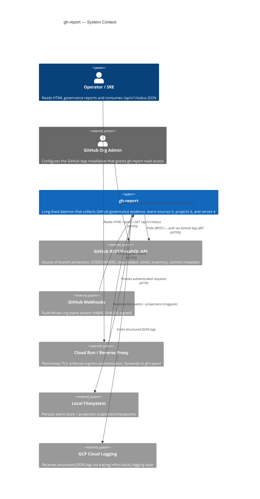
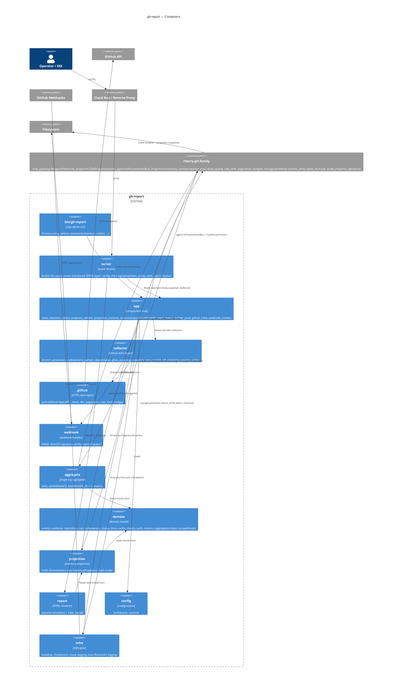
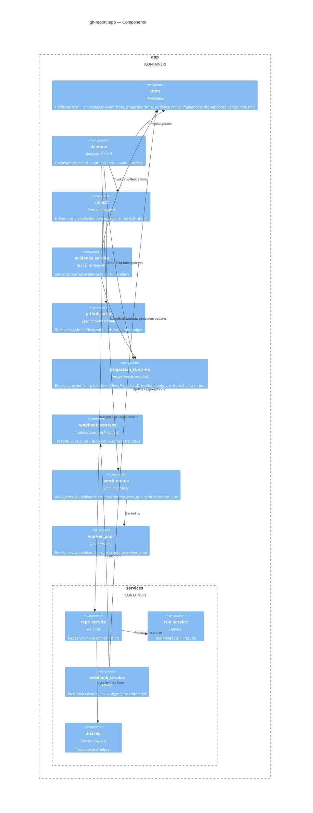
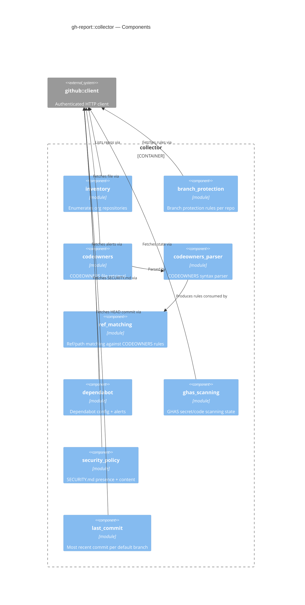

# C4 — gh-report

`gh-report` is a **GitHub organization governance collector and
reporter** (`crates/gh-report/Cargo.toml:6`). It runs as a long-lived
daemon behind Cloud Run / a reverse proxy, ingests data from the GitHub
API (REST + webhooks), event-sources a single organization-wide
aggregate via the cherry-pit family, projects evidence into an in-memory
read model, and serves HTML reports plus a JSON
`/api/v1/status` endpoint (`src/server.rs:34–41`).

Posture commitments worth knowing before reading:

- **Single-aggregate**: `ORG_GOVERNANCE_AGGREGATE_ID = NonZeroU64::new(1)`
  per Tension-2 single-aggregate lock (Cargo.toml:36–41).
- **Bus-only composition**: `cherry-pit-agent` is used for the
  `InProcessEventBus` + `ProjectionDriverExt`, **not** for the full
  `App`/`CommandGateway` wiring (Cargo.toml:42–50).
- **Durable event store**: `MsgpackFileStore<DomainEvent>` rooted at
  `<store_dir>/events/<org>/`.
- **Durable projection store**: `FileProjectionStore<EvidenceProjection>`
  rooted at `<store_dir>/projections/<org>/`,
  `projection_name = "evidence"`.

---

## L1 — System Context

---

## L2 — Container

Internal containers correspond to the top-level modules of
`crates/gh-report/src/` (verified present). External cherry-pit crates
are aggregated into a single boundary box to keep edges legible — their
internals are detailed in `docs/c4/cherry.md`.

---

## L3 — Component

Scoped to the two crate modules with the largest internal surface:
`app/` (the composition root) and `collector/` (the GitHub-evidence
ingest). `domain/`, `github/`, `webhook/`, `report/`, and `infra/` are
documented sufficiently by their container descriptions above; their
file lists are stable and small.

### app/ components

One component per `crates/gh-report/src/app/*.rs` (and the
`services/` sub-module split out separately).

### collector/ components

One component per `crates/gh-report/src/collector/*.rs`.

---

## Notes & non-goals

- The diagrams describe modules **physically present** in
  `crates/gh-report/src/` at the time of writing. New top-level
  modules will require updates here.
- The `cherry-pit family` external box on the L2 diagram is the same
  set of crates detailed in `docs/c4/cherry.md`; cross-reference
  there for cherry-pit internals.
- The vendored SERVE layer (`config`, `infra/{signal,validate}`, `state`,
  `server`, `run`) is now internal to `gh-report` after the Phase-1 P1-A
  donor-crate absorption (formerly a separate workspace crate, removed
  per bead `adr-fmt-6hmi`).
- No L4 (code-level) diagrams.
